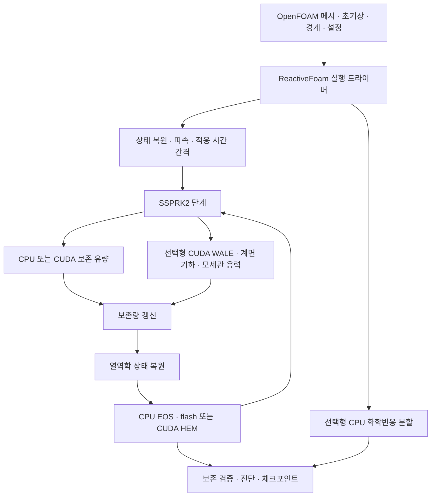

# ReactiveFoam

**ReactiveFoam**은 SPUMA/OpenFOAM의 메시·입출력 위에서 압축성 유동, 화학반응, 상전이와 수송을 선택하여 계산하는 범용 다중물리 연구 솔버다. CPU/CUDA 수송, Peng–Robinson(PR) 실유체 열역학, GPU 기체–액체 상평형 복원, WALE LES 및 실험적인 표면장력·flashing 결합을 포함한다. 기본 산술은 **FP64**, 실행 범위는 **고정 메시·단일 MPI rank**다.

> **알려진 문제 — 정적 액적의 메시 수렴은 해결되지 않았다.**
> 표면장력 경로에서 기생 유속의 메시 세분화 수렴 조건을 통과하지 못했다. `cartesianImplicit`의 16³·24³·32³, 60 ns 시험에서는 최대 속도가 각각 약 7.82×10⁻¹⁴, 2.64×10⁻¹³, 4.56×10⁻¹³ m/s로 증가했다. 절대값이 작아도 수렴 검증 통과를 뜻하지 않는다. 엄격한 `staticVelocityGatePassed` 판정은 **false**, 해당 검증 명령의 종료 코드는 **2**로 유지한다. 기본 `diffuse` 모델의 수렴 문제도 해결되었다고 간주하지 않는다.
>
> 이 문제를 알려진 제약으로 공개하고 main에 통합한다. **정적 액적 수렴 및 액주·액막의 1차 분열 정확도가 검증된 솔버라는 의미는 아니다.** [시험 결과](reports/implicit-static-drop-20260923.ko.md)와 [압력–모세관 응력의 이산 균형 검토](docs/spray-physics/capillary-static-balance-review.md)를 참고한다.

## 목차

- [물리 모델과 지원 범위](#물리-모델과-지원-범위)
- [아키텍처와 계산 흐름](#아키텍처와-계산-흐름)
- [빌드](#빌드)
- [N₂O 충돌 케이스 시작하기](#n₂o-충돌-케이스-시작하기)
- [물리 옵션](#물리-옵션)
- [백엔드와 메모리 옵션](#백엔드와-메모리-옵션)
- [시간 간격·경계·재시작](#시간-간격경계재시작)
- [검증과 성능 해석](#검증과-성능-해석)
- [추가 제약과 문서](#추가-제약과-문서)

## 물리 모델과 지원 범위

| 항목 | 현재 구현 | 주요 제약 |
|---|---|---|
| 압축성 보존 수송 | 화학종 질량·운동량·총에너지, CPU/CUDA | 공간 1차 유한체적, 기본 HLL 및 모세관 HLLC 경로, SSPRK2 |
| 열역학·상전이 | PR EOS, HEM UV flash, 증발·응축과 잠열 | HEM은 공통 압력·온도·속도의 평형 모델. 유한 속도 핵생성·상간 슬립은 없음 |
| 상전이 비활성화 | 액상 질량을 보존하여 수송하는 동결 모델 | EOS 복원은 계속 필요하며, 모든 모델 조합이 지원되지는 않음 |
| 화학반응 | Cantera/CVODE BDF, Strang 분할 | CPU 실행. GPU 화학반응과 난류–화학 상호작용(TCI)은 없음 |
| 분자 점성·열전도 | 입력한 일정 계수, 점성 일 포함 | 온도·조성에 따른 자동 물성 모델이 아님 |
| 분자 종 확산 | 공통 Fick 확산계수와 종 엔탈피 수송 | 이상기체 경로만 지원. PR 실유체 종 확산은 미지원 |
| 난류 | CUDA WALE LES 응력, 선택적인 난류 열·종 혼합 | 비반응 HEM/동결 경로. 난류 통계 및 분열 정확도 검증은 별도 과제 |
| 표면장력·flashing | 액체 체적/질량, 모세관 응력, 표면에너지와 곡면 UV 복원 결합 | **단일 순수 액체·비반응 HEM·CUDA 전용**, 정적 액적 수렴 미해결 |
| 계면 기하 | 기본 `diffuse`, 선택형 `cartesianImplicit` | 후자는 균일 Cartesian 메시의 C² 암시적 계면 복원. swept PLIC가 아님 |
| 병렬화 | 단일 rank에서 GPU 커널 및 일부 CPU 작업 병렬화 | MPI 영역 분할·분산 다중 GPU 미구현 |

기체와 응축상에 걸친 각 화학종의 총질량 밀도 `q0 … q(N-1)`, `rhoMomentum`, `rhoTotalEnergy`를 보존량으로 다룬다. 잠열과 반응열은 열역학 상태 및 총에너지에 포함되므로 별도의 중복 열원으로 더하지 않는다. 표면장력을 켜면 총에너지 정의에 **표면에너지**가 추가되고, 곡면의 상별 압력 차와 flash 복원도 함께 바뀐다.

`closure mechanicalEquilibrium`은 공통 압력·속도와 서로 다른 온도·조성을 갖는 두 환경 모델이다. 현재 비반응·비점성 경로이며 열전도·종 확산·WALE·표면장력과 조합할 수 없다. 동결 액상도 지원하지 않는다. 일반적인 다상 옵션을 자유롭게 혼합하는 대체 closure로 취급하면 안 된다.

## 아키텍처와 계산 흐름



| 경로 | 역할 |
|---|---|
| [`src/reactiveFoam`](src/reactiveFoam) | 물리 옵션 검증, 경계 조건, 적응 CFL, RK 단계, 재시도와 체크포인트 |
| [`src/reactiveThermo`](src/reactiveThermo) | Cantera/CVODE, PR EOS, 상평형·동결 복원, CPU 작업 풀과 GPU flash 수학 |
| [`src/reactiveTransport`](src/reactiveTransport) | CPU/CUDA 보존 수송, WALE, GPU 커널 및 데이터 연결 |
| [`src/reactiveInterface`](src/reactiveInterface) | 계면 기하, 모세관 균형, Cartesian 암시적 계면 |
| [`tools`](tools) | 빌드, 케이스 생성, 검증, 프로파일링과 결과 분석 |
| [`examples`](examples), [`reports`](reports), [`results`](results) | 입력 예제, 날짜별 보고서와 검증 근거 |

실행파일은 `bin/ReactiveFoam`, 주요 라이브러리는 `libreactiveBackend.so`, `libreactiveTransport.so`다. 공개 C API는 `reactive_rt_*`, `reactive_transport_*`, `reactive_gpu_hem_*` 계열이다. 이전 이름으로 빌드한 외부 클라이언트는 [명칭 전환 안내](docs/generic-naming.ko.md)에 따라 재빌드한다. 과거 체크포인트의 식별 바이트는 호환성 목적으로 유지한다.

GPU 경로에서도 메시·경계 준비, 호스트 배치 구성과 제어, 일부 물성 경로 및 파일 입출력은 CPU에 남는다. `closureBackend cuda`는 전체 프로그램이 GPU에서만 실행된다는 뜻이 아니다. 모세관 경로의 WALE PR 종 엔탈피 준비는 CUDA로 이전했지만, 비모세관 경로에는 기존 호스트 물성 준비가 남아 있다. `REACTIVE_WALE_SCALARS` 로그의 `hostEnthalpyCells`로 실제 실행을 확인한다.

## 빌드

호환되는 **SPUMA/OpenFOAM 개발 환경**, C++17 컴파일러, Cantera 3.2 개발 파일, Sundials, Eigen, fmt, OpenSSL이 필요하다. CUDA 빌드에는 CUDA 툴킷과 대상 GPU가 필요하다. GPU 필드 API를 사용하는 코드이므로 일반 OpenFOAM 설치만으로 같은 빌드를 보장하지 않는다. 최근 계측 환경은 SPUMA/OpenFOAM 2512, RTX 5080, CUDA 런타임 13.2다.

다음 경로는 설치 위치에 맞게 바꾼다. `REACTIVE_CUDA_ARCH=120`은 RTX 5080 예시이며 다른 GPU에서는 해당 아키텍처를 지정한다.

```bash
export REACTIVE_SPUMA_ENV=/path/to/compatible/spuma-env.sh
export REACTIVE_PREFIX="$PWD/research/reactive-env"
export REACTIVE_RUN_LOCK=/tmp/reactivefoam-run.lock

micromamba create -y -p "$REACTIVE_PREFIX" -c conda-forge \
  --strict-channel-priority python=3.12 cantera=3.2 libcantera-devel=3.2 \
  coolprop=6.7 scipy numpy pyyaml matplotlib

export REACTIVE_TRANSPORT_BUILD=cuda
export REACTIVE_CUDA_ARCH=120
flock "$REACTIVE_RUN_LOCK" ./Allwmake
source ./env.sh
```

`./Allwmake`는 백엔드, 수송 라이브러리, 솔버를 순서대로 빌드한다. CUDA 빌드에서도 CPU 수송을 선택할 수 있다. `REACTIVE_TRANSPORT_BUILD`의 기본값은 `cpu`, CUDA 아키텍처의 기본값은 `80`이므로 대상 환경에 맞춰 명시한다. `env.sh`가 SPUMA 환경과 실행파일·라이브러리 경로를 설정한다.

[`tools/reactive-env-linux64.lock`](tools/reactive-env-linux64.lock)은 기존 Linux x86-64-v4 환경의 패키지 고정 기록이다. 다른 CPU/플랫폼에서의 호환성을 보장하는 파일은 아니다. 반응기구 준비는 [반응 자료 준비](README.reactive-phase.ko.md#반응-자료-준비)를 참고한다.

## N₂O 충돌 케이스 시작하기

현재 벤치마크는 **한 변 80 mm인 정육면체**, 서로 90도로 향하는 **지름 5 mm 입구 두 개**, **입구 z=40 mm**, **293.15 K·55 bar(g) 액체 N₂O 공급**, **1 atm 또는 40 bar(abs) 환경**이다. 공급 절대압은 56.01325 bar다. Cartesian 경계 면으로 원형 입구를 근사하므로 거친 메시에서는 유효 입구 면적과 형상이 제한된다.

메시 시리즈는 40³ = 64,000셀, 80³ = 512,000셀, 160³ = 4,096,000셀이다. 아래 예시는 작은 40³ 메시에서 준비한 뒤 **40 bar 케이스만 두 스텝** 실행한다. 출력 디렉터리는 새 경로를 사용한다.

```bash
"$REACTIVE_PREFIX/bin/python" tools/prepare_impinging_n2o.py cases/n2o-base \
  --configuration examples/impinging-n2o-supercooled/cold-pr-148K-config.yaml \
  --cells-per-axis 40 --domain-mm 80 --nozzle-diameter-mm 5 --inlet-z-mm 40

"$REACTIVE_PREFIX/bin/python" tools/prepare_capillary_impingement.py \
  --source cases/n2o-base --output cases/n2o-capillary \
  --sigma 0.0020577273399028486 --steps 2

flock "$REACTIVE_RUN_LOCK" ReactiveFoam -case cases/n2o-capillary/ambient_40bar_abs
```

첫 생성기는 두 환경압의 기본 케이스를 만들며 표면장력을 끈다. 두 번째 도구가 점성·열전도·WALE 응력·난류 열/종 혼합·표면장력을 켠 파생 케이스를 만든다. N₂O 단독 비반응 조건에서 화학반응, 고체·승화, 분자 종 확산은 제외한다. 이 명령은 100 μs 캠페인을 실행하는 명령이 아니다.

입구는 정지 `fixedState` 저장조 ghost state에서 압력 차로 유량을 계산한다. 노즐 내부를 해상하거나 실제 출구 속도를 직접 지정한 모델이 아니다. 현재 [과냉각 액체 입력](examples/impinging-n2o-supercooled)은 148 K까지 PR 액체 가지를 연장하고 증발·응축을 유지한다. **삼중점 아래 실제 고체 평형을 나타내지 않는다.**

`prepare_impinging_n2o.py`처럼 GPU 실행 잠금을 내부에서 획득하는 도구에는 외부 `flock`을 중복 적용하지 않는다. 직접 솔버를 실행할 때는 위와 같이 잠금을 사용하여 같은 GPU의 다른 벤치마크와 겹치지 않게 한다.

## 물리 옵션

모델 설정은 `constant/reactiveProperties`, 열역학·기구 설정은 `thermoConfiguration`이 가리키는 YAML 파일에 둔다. 케이스 생성기는 상대 기구 경로를 절대경로로 바꾼다. 다음은 **모세관 N₂O 모델의 핵심 설정 예시**이며 메시·초기장·경계 정의까지 포함한 완전한 케이스는 아니다.

```foam
closure                  HEM;
thermoConfiguration      "/absolute/path/to/thermo-config.yaml";
initialization           primitive;
transportBackend         cuda;
closureBackend           cuda;
closureScalarBackend     cpu;
closureCpuFallback       false;
closureJacobian          analytic;
thermoExactReuse          true;

physics
{
    chemistry            false;
    phaseChange          true;
    viscosity            true;
    heatConduction       true;
    speciesDiffusion     false;
    turbulence           WALE;
    turbulentHeatFlux    true;
    turbulentSpeciesMixing true;
    surfaceTension       true;
}

dynamicViscosity          1.821e-5;
thermalConductivity      0.02587;
molecularDiffusivity        0;
waleCw                   0.325;
turbulentPrandtl          0.85;
turbulentSchmidt          0.7;
surfaceTensionCoefficient 0.0020577273399028486;
capillaryGeometry        diffuse;
capillaryCfl             0.25;
```

점성계수·열전도율·표면장력 계수는 이 벤치마크의 상수 입력이다. 전 온도·조성 범위에서 검증한 물성 상관식이 아니다. SI 단위를 사용한다.

| `physics` 키 | 생략 시 동작 | 의존관계 |
|---|---|---|
| `chemistry` | 최상위 `chemistry` 값, 그것도 없으면 `false` | `combustion`은 별칭. 둘 다 지정하면 값이 같아야 함 |
| `phaseChange` | 액체 종이 있으면 `true` | 끄면 액상 질량의 동결 수송. 열역학 복원 자체는 생략하지 않음 |
| `viscosity` | `dynamicViscosity`가 0이 아니면 활성화 | 활성화 시 유한한 양의 계수 필요 |
| `heatConduction` | `thermalConductivity`가 0이 아니면 활성화 | 활성화 시 유한한 양의 계수 필요 |
| `speciesDiffusion` | `molecularDiffusivity`가 0이 아니면 활성화 | 활성화 시 양의 계수 필요. PR EOS에서는 미지원 |
| `turbulence` | `none` | `none` 또는 `WALE`. WALE는 CUDA·비반응 HEM/동결 경로 |
| `turbulentHeatFlux` | `false` | WALE 필요. 분자 열전도와 별도로 선택 |
| `turbulentSpeciesMixing` | `false` | WALE 필요. 동결 응축상이 있으면 미지원. 분자 종 확산과 별도로 선택 |
| `surfaceTension` | `false` | 단일 순수 액체, 비반응 HEM, CUDA 수송·전체 복원, CPU fallback 비활성화 필요 |

알 수 없는 `physics` 키와 지원하지 않는 조합은 입력 검증에서 거부한다. WALE 계수 `waleCw` 기본값은 0.325이며, 난류 열·종 혼합에는 각각 양의 `turbulentPrandtl`(기본 0.85), `turbulentSchmidt`(기본 0.7)가 필요하다.

`phaseChange false`인 모세관 시험은 액체 질량 교환을 막는 동결 모델이다. flashing에는 `phaseChange true`가 필요하다. 동결 응축상에서는 난류 종 혼합을 끈다.

표면장력을 **끄면 전용 상태 슬롯·작업 공간, 계면 기하, 표면에너지 및 모세관 CFL 연산을 제외**한다. EOS나 별도로 선택한 WALE·상전이 연산은 계속 수행한다. 표면장력 켜기/끄기는 에너지 정의와 모델 식별값을 바꾸므로 기존 체크포인트의 해시를 수정하여 재사용하지 말고 해당 모델로 케이스를 준비한다.

| 표면장력 관련 키 | 기본값 | 의미 |
|---|---|---|
| `surfaceTensionCoefficient` | 활성화 시 필수 | 일정한 양의 σ [N/m] |
| `capillaryGeometry` | `diffuse` | `diffuse` 또는 실험적인 `cartesianImplicit` |
| `capillaryCfl` | 0.25 | 모세관 시간 간격 계수. 0보다 크고 0.5 이하 |
| `capillaryGeometryTolerance` | 1e-10 | 계면 기하 허용 오차 |
| `capillaryQuadratureTolerance` | 1e-8 | 암시적 계면 적분 허용 오차 |
| `capillaryVolumeTolerance` | 1e-7 | 체적 적합 허용 오차 |
| `capillaryFitSmoothness` | 0.01 | 계면 적합의 평활화 계수 |
| `capillaryFitLinearTolerance` | 1e-9 | 선형 풀이 허용 오차 |
| `capillaryFitIterations` / `capillaryFitLinearIterations` | 32 / 1600 | 적합 및 내부 선형 풀이 반복 상한 |

`cartesianImplicit`는 액체 체적에서 공유 C² 계면을 GPU로 복원하고, 공유 면 aperture와 적분 traction을 실제 RK 수송에 사용한다. 선택만으로 정적 액적 수렴이나 정확한 액적 분열이 보장되지는 않는다. [모세관 모델 문서](docs/spray-physics/capillary-flashing.ko.md)를 함께 읽는다.

## 백엔드와 메모리 옵션

| 키 | 기본값 | 용도 및 제약 |
|---|---|---|
| `transportBackend` | `cpu` | 보존 수송 `cpu` / `cuda` |
| `closureBackend` | `cpu` | 전체 상태 복원 `cpu` / `cuda` |
| `closureScalarBackend` | `cpu` | 별도의 온도 후보 평가 가속. 전체 GPU flash와 구분 |
| `closureCpuFallback` | `true` | GPU 복원 실패 시 CPU 허용 여부. 모세관 모델은 `false` 필수 |
| `closureJacobian` | `finiteDifference` | `analytic`은 전체 CUDA 복원 전용. 곡면(J≠0) 모세관 셀도 포함하며, 해석식이 실패한 상태만 유한차분으로 대체. 모세관 N₂O 케이스 생성기의 기본값 |
| `closureSearch` | `reference` | `stableGasPrune`은 전체 CUDA 복원·단일 순수 액체상·고체 없음 조건에서 명시적으로 선택. 안정성 검사를 통과한 전 기체 셀의 두 상 seed 탐색 생략(정책 태그 `stable-gas-prune-v1`). 솔버와 생성기 모두 기본값 `reference`. 비트 동일성 검증 범위는 40 bar N₂O/공기 125–200 μs 및 200 μs 이후 10스텝이며, 다른 조건은 재검증 필요 |
| `thermoWorkers` | 1 | CPU 열역학 작업자, 1–64 및 배치 크기 이하 |
| `thermoBatchCells` | 64 | 열역학 배치 상한, 셀 수와 메모리 예산에 의해서도 제한 |
| `thermoExactReuse` | 비반응·비동결·비모세관 HEM에서 활성화 | 완전히 동일한 상태만 재사용. CUDA 모세관 모델에서는 명시적으로 켤 수 있음 |
| `maxThermoBatchMemoryMB` | 64 | 열역학 배치 메모리 예산, 1 MB = 10⁶ bytes |
| `maxDeviceMemoryGB` / `maxHostMemoryGB` | 2 / 2 | 추정 장치/호스트 작업 공간 예산, 1 GB = 10⁹ bytes |
| `transportBlockThreads` | 256 | CUDA 수송 블록 크기 |
| `transportBridgeCells` | 0 | 전송 bridge 크기 설정. 0은 기본 처리 경로 |
| `transportStagingBytes` / `maxPinnedTransportBytes` | 67,108,864 / 67,108,864 | 전송 staging/pinned 메모리 설정. 작은 메시에서는 메시 크기로 제한 |
| `transportDetailedGasCounters` | `false` | 추가 기체 수송 진단 카운터 |

전체 CUDA HEM 복원은 현재 **PR EOS·화학종 최대 16개·액체 종 최대 2개**의 비반응 경로다. 모세관 모델에서는 액체가 하나로 더 제한된다. `closureBackend cuda; closureScalarBackend cpu;`는 정상적인 전체 GPU flash 설정이다. 이때 `cpu`라는 후보 평가 설정만 보고 전체 flash가 CPU fallback이라고 판단하면 안 된다. `closureScalarBackend cuda`는 비반응 평형 후보 평가의 별도 옵션이며 모세관 경로와 조합하지 않는다.

`closureLibrary`, `closureScalarLibrary`의 기본값은 `libreactiveTransport.so`다. `analytic`은 곡면 flash에서도 기체·액체를 각자의 상 압력에서 평가한 해석 Jacobian을 사용한다. 100 μs 체크포인트의 실제 N₂O 배치에서 HEM 커널은 3.50 s에서 1.45 s로 줄었다([GPU HEM 최적화 기록](reports/gpu-hem-optimization-20260925.ko.md)).

최근 160³ 계측에서는 `thermoWorkers 1`, `thermoBatchCells 1048576`, `thermoExactReuse true`, `maxThermoBatchMemoryMB 2097.152`, `maxDeviceMemoryGB 12`, `maxHostMemoryGB 32`를 사용했다. 이는 해당 하드웨어의 측정 설정이며 전역 기본값이 아니다. 메모리 옵션은 알려진 배열의 예산 검사이며 프로세스 전체 메모리의 엄격한 상한은 아니다. Nsight replay 메모리도 별도로 고려한다.

화학반응 관련 기본값은 `chemicalRelativeTolerance 1e-8`, `chemicalAbsoluteTolerance 1e-14`, `chemicalJacobian structured`, `chemicalLinearSolver dense`다. Jacobian은 `structured`/`fullRHS`, 선형 솔버는 `dense`/`sparse`/`auto`/`matrixFree`/`matrixFreeWoodbury`를 받지만 모델별 지원 제약이 있다. `recoveryMode reference`가 기본이며 `boundaryFallback`도 제한된 비반응 HEM 조건에만 적용된다. [추가 모델 옵션](README.reactive-phase.ko.md)과 [상평형 가속 문서](docs/closure-acceleration.ko.md)의 날짜별 적용 범위를 확인한다.

## 시간 간격·경계·재시작

`system/controlDict`에서 종료 시간과 시간 간격 상한을 지정한다. 예를 들어 100 μs까지, 최대 50 ns 간격으로 계산하려면 다음과 같이 설정한다.

```foam
application       ReactiveFoam;
startFrom         startTime;
startTime         0;
stopAt            endTime;
endTime           1e-4;
deltaT            3e-8;
maxDeltaT         5e-8;
maxCo             0.25;
maxAcceptedSteps  0;
writeControl      runTime;
writeInterval     1e-5;
writeFormat       binary;
writePrecision    17;
writeCompression  off;
timeFormat        general;
timePrecision     15;
runTimeModifiable false;
functions         {};
```

솔버는 **매 스텝 현재 유동·파속과 선택한 확산/모세관 제약으로 안정 시간 간격을 다시 계산**한다. `deltaT`가 고정 스텝을 강제하지 않는다. `maxDeltaT`는 필수 양의 상한이고 `maxCo` 기본값은 0.25(0 < 값 ≤ 0.5), `waveSpeedFactor` 기본값은 1.1(≥ 1)이다. 안정성 여유 계수 0.95를 적용하며 종료 시각에서는 마지막 스텝을 자른다. **30–50 ns 범위의 최저 간격을 보장하지 않는다.** 메시·국소 파속·확산·표면장력에 따라 더 짧아질 수 있다.

`maxAcceptedSteps 0`은 별도 스텝 수 제한이 없다는 뜻이다. 작은 값으로 초기 연산량 검증을 제한할 수 있다. 실행 중 사전 재읽기와 일반 OpenFOAM function object는 지원하지 않으므로 `runTimeModifiable false`, 빈 `functions`, `stopAt endTime`을 사용한다.

경계 모델은 `fixedState`, `slipWall`, `extrapolate` 및 일치하는 평행이동 cyclic 경계다. 회전 cyclic, AMI, processor 경계는 지원하지 않는다. `fixedState`에는 `p`, `T`, `U`, 화학종 수에 맞는 `Y`, 길이 2의 `liquidFractions`를 지정하고 상평형 일관성을 만족해야 한다. `mechanicalEquilibrium`의 `fixedState`는 미지원이다.

체크포인트 옵션은 `checkpointEverySteps`(기본 0), `checkpointFirstStep`(기본 `true`), `checkpointOnFailure`(기본 `true`)다. 재시작 시 모델·수치 정책·필드 식별 정보의 호환성을 검사한다. 원시 체크포인트나 해시를 임의로 바꾸지 않는다. 구간별 재시작과 독립 계측 실행은 [장시간 GPU 캠페인](docs/long-gpu-campaign.ko.md)의 도구를 참고한다.

## 검증과 성능 해석

| 로그 | 확인할 내용 |
|---|---|
| `REACTIVE_RUNTIME`, `REACTIVE_PHYSICAL_MODEL` | 실행 및 물리 모델 식별 정보 |
| `REACTIVE_PHYSICS`, `REACTIVE_BACKENDS` | 실제 선택한 물리·백엔드 |
| `REACTIVE_STEP`, `REACTIVE_RETRY` | 시간 간격, 상태 범위, 보존 오차와 재시도 |
| `REACTIVE_STEP_TIMINGS` | 스텝별 연산 시간 |
| `REACTIVE_GPU_HEM`, `REACTIVE_GPU_HEM_STEP` | 제출 상태 수, 실패·fallback, GPU 커널과 복사 |
| `REACTIVE_WALE_PR`, `REACTIVE_WALE_SCALARS` | 난류 물성과 혼합, 호스트 엔탈피 처리 수 |
| `REACTIVE_CAPILLARY_STEP`, `REACTIVE_CAPILLARY_PROFILE`, `REACTIVE_CHECKPOINT` | 계면 비용, 외부 반복에서 다시 flash한 셀(`flashedCells`)과 입력이 같아 재사용한 셀(`reusedCells`), 체크포인트 기록 |

로그 시간에는 중첩 구간이 있다. 열역학 복원 시간과 그 안의 GPU HEM 시간을 더하면 이중 집계된다. Nsight Systems/Compute의 상세 계측은 별도 실행으로 분리하고, replay를 포함한 진단 벽시계 시간을 일반 해석과 직접 비교하지 않는다. GPU 성능 카운터는 드라이버에서 해당 사용자에게 허용되어야 한다.

최근 완료한 **160³·40 bar(abs)·1→100 μs** 캠페인에서는 점성·열전도·WALE 응력·난류 열/종 혼합·표면장력·flashing을 켰다. 화학반응·고체·승화·분자 종 확산은 껐다. 본 해석 1,931개 추가 스텝은 **23,603.32초(약 6시간 33분)**가 걸렸으며 재시도, GPU 실패, CPU fallback은 없었다. 열역학 복원은 본 해석 시간의 **85.34%**, 그 안의 GPU HEM 커널은 전체의 **65.47%**였다. 구간 종료로 잘린 스텝을 제외한 시간 간격은 **50.81–51.59 ns**였다. 위 50 ns 상한 예시와 이 캠페인의 설정은 구분해야 한다.

이 결과는 실행·보존 및 성능 계측 근거이며, 발달한 분사류 충돌·분열·공간 수렴의 검증 결과는 아니다. [100 μs 분석 보고서](reports/n160-40bar-100us-gpu-analysis-20260925.ko.md)와 [데이터·검증 manifest](results/benchmarks/n160-40bar-100us-gpu-20260924)를 함께 제공한다.

| 검증/실험 | 근거 |
|---|---|
| 물리 스위치와 의존관계 | [selection 보고서](reports/reactive-physics-selection-20260921.md), [검증 집계](results/physics-selection-20260921/validation-summary.json) |
| 적응 시간 간격과 메시별 초기 실행 | [40³/80³, 1 μs](reports/impinging-cube80-z40-adaptive-1us-20260923.ko.md), [160³ GPU 계측](reports/impinging-cube80-n160-gpu-profile-20260924.ko.md) |
| HEM 배치와 정확한 상태 재사용 | [최적화 보고서](reports/hem-utilization-optimization-20260924.ko.md) |
| FP32/INT32 실험 | [현재 솔버 정밀도 실험](reports/current-solver-precision-20260924.ko.md). 전체 해석의 유의미한 가속을 입증하지 못했으며 기본 FP64 유지 |
| 공개 API 명칭 변경과 재시작 | [이전 안내](docs/generic-naming.ko.md), [회귀 검증](results/generic-naming-20260924/validation.json) |
| 모세관 계면과 정적 액적 | [구현/시험 보고서](reports/implicit-static-drop-20260923.ko.md). 엄격한 속도 수렴 게이트는 실패 상태 |

검증 도구는 [`tools`](tools)에 있다. 반응 자료를 준비한 환경에서는 다음 명령으로 물리 옵션의 CPU/CUDA 검증을 실행할 수 있다. 이 도구는 GPU 실행 잠금을 내부에서 획득한다.

```bash
"$REACTIVE_PREFIX/bin/python" tools/validate_reactive_physics.py \
  --thermo-dir research/reactive-thermo --output cases/physics-check --backends cpu cuda
```

## 추가 제약과 문서

- HEM은 즉시 상평형을 가정한다. 유한 속도 핵생성, 상간 슬립, Lagrangian 액적 추적 및 검증된 분열·합체 모델은 구현되어 있지 않다.
- 기본 HEM의 물질 접촉면 정확도와 고압 다상 반응의 fugacity/반응속도 일관성에는 추가 검증이 필요하다. 제한적인 `mechanicalEquilibrium` 모델이 모든 문제를 해결하는 것은 아니다.
- 현재 N₂O 입력은 고체상과 승화를 제외한다. 저장소에 남아 있는 과거 고체 관련 코드·보고서는 이 벤치마크에서 고체를 계산한다는 뜻이 아니다.
- MPI 영역 분할, TCI, 정적 액적 수렴 및 난류 분열 정확도는 main 병합 이후에도 미구현 또는 미검증 항목으로 남는다.

이 **README.md가 현재 솔버의 기본 안내**다. [상세 모델 설명](README.reactive-phase.ko.md), [물리 선택 문서](docs/spray-physics/physics-switches.ko.md), [구현 기록](docs/spray-physics/implementation-status.ko.md)은 작성 시점의 범위와 함께 읽는다. 날짜가 붙은 보고서의 CPU 경로·Draft 상태·성능 수치는 당시 기록이며 현재 상태를 소급하여 바꾸지 않는다. ColdFoam의 과거 결과 역시 현재 ReactiveFoam의 성능·정확도 근거가 아니다. 과거 소스는 Git 이력에서 확인할 수 있다.

SPUMA/OpenFOAM에서 파생한 코드는 GPL-3.0-or-later 조건을 따른다. [LICENSE](LICENSE)를 확인한다.
