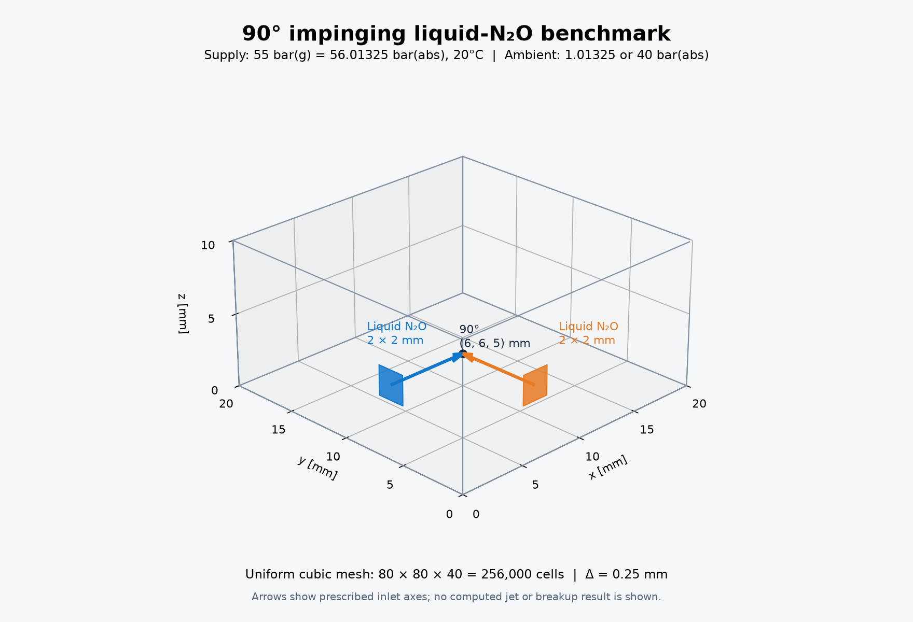

# 90도 액체 N₂O 충돌 벤치마크

**현재 구성:** 80 mm 정육면체의 40³·80³·160³ 메시, 지름 5 mm 원형 입구, 입구 z=40 mm를 사용한다. 과냉각 액체 N₂O, flashing, 점성·열전도·WALE 혼합·표면장력을 켜고 고체·승화·연소는 제외한다. [메시 시리즈](../../reports/impinging-cube80-initial-steps-20260923.ko.md), [z=40 mm 적응 시간 간격 실행](../../reports/impinging-cube80-z40-adaptive-1us-20260923.ko.md), [160³ GPU 분석](../../reports/impinging-cube80-n160-gpu-profile-20260924.ko.md)을 참고한다.

**아래 본문은 초기 2026-09-22 구성과 결과의 기록이다.** 256k 메시, 당시 꺼져 있던 물리 옵션과 저온 복원 한계를 현재 설정으로 해석하지 않는다. 현재의 [과냉각 액체 프로필](impinging-n2o-supercooled.ko.md)과 중간 [고체 모델 기록](impinging-n2o-solid-recovery.ko.md)은 별도로 보존한다.

두 케이스를 생성했다. 두 분사구 모두 20°C의 순수 액체 N₂O를 공급하고, 공급압은 **55 bar(g) = 56.01325 bar(abs)**로 동일하다. 외부 압력만 바꾼다.

| 케이스 | 외부 절대압 | 공급–외부 차압 |
|---|---:|---:|
| `ambient_1atm` | 1.01325 bar | 55 bar |
| `ambient_40bar_abs` | 40 bar | 16.01325 bar |

생성 폴더: `/home/jsw/문서/analysis/runs/impinging_n2o_90deg_20260922`. 각 하위 케이스의 `impinging_n2o.foam` 파일을 ParaView에서 연다. 원본 케이스에는 초기장만 있으며, 검증 실행은 별도 폴더에 보존했다.



## 메시와 경계

영역은 **20 × 20 × 10 mm**, 셀은 **0.25 mm 정육면체 256,000개(80 × 80 × 40)**다. 사용자 범위 10만–100만 안에 있다. 각 2 × 2 mm 정사각 분사구에는 8 × 8개 면이 배치된다. x=0 면에서 +x, y=0 면에서 +y로 들어오는 두 중심선이 `(6,6,5) mm`에서 90도로 만난다.

`checkMesh -allGeometry -allTopology` 통과: 비직교성 0°, 최대 aspect ratio 1.000000000000063, 최대 skewness 약 1.04e-13. 별도 Python 검사로 실제 binary 메시의 정육면체 격자, 입구 면적 각각 4e-6 m², 외향 법선 (-1,0,0)/(0,-1,0), 중심 위치 및 케이스 입력 SHA-256도 확인했다.

초기 공간은 정지한 79% N₂/21% O₂ 공기(몰분율)다. 공급구와 외부 면 모두 고정 열역학 상태를 주는 `fixedState` 경계다. 공급구 ghost 상태는 압축 액체 N₂O, `U=0`이며 압력차를 HLL 면 플럭스가 푼다. **실제 노즐 내부 가속·초킹·유량계수 또는 전압력 경계 모델은 포함하지 않는다.** 공급구 이외의 x=0, y=0 면은 `slipWall`, 나머지 외부 면은 해당 배압의 공기 저장조 경계다.

## 물리 설정

- GPU HEM 상평형 복원·상변화와 GPU 보존 수송을 활성화했다. CPU fallback은 비활성이다.
- WALE stress-v1 운동량 응력과 총에너지 응력 일을 활성화했다. 화학반응, 분자 점성·열전도·종 확산, SGS 열/종 유속은 비활성이다.
- 현재 HEM에는 기하학적 VOF·표면장력 유동 결합이 없다. 이 케이스는 우선 압력 구동 충돌류와 평형 flash를 검증하기 위한 입력이며, 액막 분열·액적 생성 검증은 별도 단계다.
- 시간 간격 상한 30 ns, 예비 종료시간 1 ms, 저장 간격 10 μs. CFL 또는 복원 실패 시 dt는 줄어든다. 1 ms까지의 결과는 생성하지 않았다.

동일 PR 모델에서 20°C 포화압은 50.769 bar이므로 공급은 압축 액체다. 등엔탈피 감압의 0D 평형 증기 질량분율은 1 atm에서 약 0.585, 40 bar에서 약 0.134다. 이 값은 공간 유동의 정답이나 입구 속도가 아니다. 독립 Helmholtz EOS와의 비교 및 현재 PR 액체 밀도 오차(약 -5.72%)는 [물성 분석](impinging-n2o-thermodynamics.md)에 남겼다.

## 초기 256k GPU 1스텝 결과 — 수정 전 기록

| 외부 압력 | 완료 dt | 재시도 | CPU fallback | 수용 상태 |
|---|---:|---:|---:|---|
| 1 atm | **0.808876 ns** | **5** | 0 | 한 스텝은 완료했으나 정상 GPU 복원 게이트 실패 |
| 40 bar(abs) | **25.636196 ns** | **0** | 0 | 유한 상태·보존 수지·체크포인트 검사 통과 |

두 케이스는 각각 한 번만 실행했다. 대기압의 123개 GPU 복원 실패는 반려된 시도에서 발생했다. 성공한 마지막 상태만 결과로 승인됐으며 실패 로그도 보존했다. 40 bar의 시간 간격은 음향/수송 CFL로 제한되었다. 메시 품질 검사는 양호하며, 셀 크기에 따른 정상 CFL 제한과 복원 실패에 의한 추가 감소를 구분해야 한다.

대기압 실패 로그에서 대표 상태 5개만 동일 CPU backend로 재생했다. 첫 3개는 같은 질량·에너지를 유지한 채 포화선 근처의 탐색 초기값에서 해가 발견됐다. **CPU/GPU 공통 탐색 초기화 문제**다. 나머지 2개는 현 fluid 모델 하한 182.34 K의 안정 기체 상태보다 목표 에너지가 낮아 허용 영역 밖을 요구했다. 현재 고체 N₂O 모델은 없다. [재현 결과](../../results/benchmarks/impinging-n2o-recovery-diagnosis.json)에 조건과 해시를 기록했다. 이 작업에서 솔버를 수정하거나 장시간 실행하지 않았다.

두 첫 스텝에서 유입된 셀 평균 N₂O는 모두 기상으로 복원됐다. 이는 처음 공기와 섞인 수치 셀의 짧은 과도 상태이며, **실제 완전기화율이나 발달한 충돌류를 검증한 결과가 아니다.** 충돌 위치까지 도달하는 유동·flashing 검증은 아직 수행하지 않았다. 대기압 케이스는 복원 문제를 해결한 뒤 진행할 필요가 있다.

결과 파일: [메시](../../results/benchmarks/impinging-n2o-mesh.json), [GPU 1스텝](../../results/benchmarks/impinging-n2o-gpu-smoke.json), [수용 기준](impinging-n2o-acceptance.ko.md). 전체 실행 로그와 출력은 `logs/impinging-n2o-validation-v1`에 있다.

## 재생성과 사용

저장소 루트에서 호환 SPUMA 환경과 Python 환경을 지정한다.

```bash
export REACTIVE_SPUMA_ENV=/home/jsw/cae-gpu-pr1-compatible/env.sh
PYTHON=/home/jsw/문서/analysis/spuma-multiphysics/research/reactive-env/bin/python

"$PYTHON" tools/prepare_impinging_n2o.py /path/to/new-output \
  --configuration /path/to/cold-pr-config.yaml --cell-mm 0.25

"$PYTHON" tools/check_impinging_n2o_mesh.py /path/to/new-output \
  --output /path/to/mesh-validation.json

"$PYTHON" tools/validate_impinging_n2o.py --benchmark /path/to/new-output \
  --output /path/to/new-one-step-validation
```

검증기는 문제를 숨기지 않도록 정상 GPU 복원 게이트 실패 시 비정상 종료 코드를 반환하고 JSON에 실패 이유를 남긴다. 기존 실행 로그/체크포인트만 재분석하려면 같은 output 경로와 `--analyze-existing`를 사용한다. 이 옵션은 솔버를 실행하지 않는다.

기화 질량 분석은 완전한 schema-3 체크포인트의 해시·레이아웃을 확인한 뒤 `q_N2O - liquidMass_N2O - solidMass_N2O`로 기상 N₂O를 구한다. 초기 액체 전용 모델은 고체 질량이 0이다. 공기를 포함하는 `alphaGas`를 N₂O 증기 질량분율로 사용하지 않는다.

```bash
"$PYTHON" tools/analyze_impinging_n2o.py /path/to/completed-case \
  --output /path/to/n2o-phase-budget.json
```

추가 격자 후보는 0.2 mm/500,000셀, 1/6 mm/864,000셀이다. 이번에는 세분 케이스를 실행하지 않았다. 입력 정의는 [specification.json](../../examples/impinging-n2o-90deg/specification.json), 메시 사전은 [blockMeshDict](../../examples/impinging-n2o-90deg/blockMeshDict)에 저장했다.
