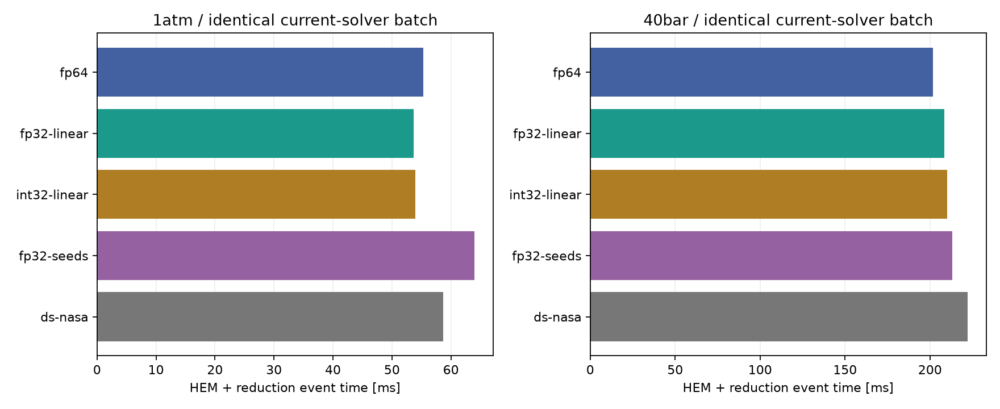

# 현재 ReactiveFoam의 FP32·정수 연산 실험

2026-09-24. 현재 솔버의 실제 N₂O/HEM 입력과 전체 160³ 계산으로 평가했다. 예전 CSR·압력 방정식 실험은 이 보고서의 근거에 포함하지 않았다. **혼합 정밀도 선형계는 정확성을 유지했지만 전체 실행의 유의미한 가속을 확인하지 못했다. 기본 FP64를 유지한다.**

## FP64가 더 큰 병목이 되었는가

앞선 배치 확대·정확 재사용으로 쉬운 중복 상태가 제거되면서 **남은 어려운 HEM 커널에서 FP64 파이프의 활용도가 높아졌다.** 현재 40 bar 대표 배치의 FP64 pipe 지표는 42.83%이며, FP64 동적 연산은 약 283.65억 FLOP이다. 반면 1기압 대표 배치는 FP64 pipe 3.19%에 불과하다. 환경과 셀별 수렴 난이도에 따라 병목이 다르다.

이를 “전체 시간의 42.83%가 FP64”라고 해석하면 안 된다. 파이프 지표는 해당 커널의 처리율을 나타내며 독립적인 시간 분해가 아니다. 앞선 최적화에서 HEM 절대 시간은 크게 줄었고, 이번 FP64 전체 실행의 HEM CUDA event 합은 1기압 **14.46/159.63초=9.06%**, 40 bar **13.86/129.27초=10.72%**다. 이 부분을 완전히 없앤다고 가정해도 다른 비용이 같다면 전체 가속 상한은 각각 약 **1.10배·1.12배**다. 수송의 FP64나 회복 중 호스트 처리까지 포함하는 상한은 아니다.

## 실험 범위와 비교 방법

- RTX 5080, 84 SM, 16 GB, 드라이버 595.91.07. CUDA sm_120, `-O2 --fmad=false --ftz=false --prec-div=true --prec-sqrt=true`. DS의 오차 복원에만 명시적인 FP32 FMA를 사용했다.
- 80 mm 정육면체, 160³=4,096,000셀, 지름 5 mm 직교 입구, z=40 mm. 공급 55 bar(g), 293.15 K; 환경 1.01325/40 bar(abs). 적응 Δt로 0→1 μs.
- flashing·과냉각 액체·점성·열전도·WALE·난류 열/종 혼합·표면장력 유지. 고체·승화·연소·분자 종 확산은 꺼짐. CUDA 열역학/수송, 물리 계산의 CPU 폴백 금지.
- HEM 배치 상한 1,048,576셀과 정확 재사용을 유지했다. 현재 솔버가 실제 제출한 비초기화 배치에서 q, 내부에너지, seed, 계면 데이터를 그대로 추출했다. 대표 입력은 1기압 10,756개, 40 bar 10,006개 상태다. 합성 행렬이나 예전 별도 솔버의 입력을 성능 근거로 사용하지 않았다.
- 배치 시험은 같은 입력을 매번 복원하고 1회 워밍업 뒤 7회 측정했다. 완화 허용오차 시험은 3회다. 시간은 HEM+진단 reduction의 CUDA event 중앙값이다.
- 전체 계산은 같은 최신 백엔드·수송·솔버 바이너리, 같은 초기 primitive 입력에서 각각 새로 시작했다. HEM 전용 실험 라이브러리만 교체했다. 체크포인트의 수치 정책 해시를 편집하여 재시작하지 않았다.
- 전체 시간은 Nsight 없이 NVML 0.5초 관측만 사용했다. NCU replay 계측은 별도 실행했다. 전체 각 조건은 1회이므로 1% 미만 차이를 확정적인 가속으로 주장하지 않는다.

## 구현한 변환

| 경로 | 낮춘 연산 | 유지한 연산과 복귀 조건 |
|---|---|---|
| FP32 선형계 | Newton 방향을 구하는 2~4차 LU | 원행렬 잔차·보정과 최종 비선형 수렴 FP64. 불확실한 pivot은 GPU FP64 LU로 복귀 |
| INT32 선형계 | Q26 고정소수점 LU | 곱셈·나눗셈 중간값 INT64. overflow/불확실한 rank는 복귀, clamp 없음 |
| FP32 cubic seed | PR cubic의 초기 `cbrt/acos/cos` | 계수·판별식·근 분기·Newton 보정·최종 근 검사는 FP64 |
| FP32 seed+선형계 | 위 두 경로 결합 | 같은 FP64 검증 |
| FP32 NASA | NASA7/9의 cp/h/s 다항식 | T·테이블 저장·log(T)·1/T·EOS·보존 변수는 FP64 |
| 2×FP32 NASA | 두 float와 오차 복원으로 다항식 계산 | 위 FP64 경계 유지 |

선형계의 중간 방향 허용오차는 2×10⁻⁶이며 최종 열역학 허용오차를 느슨하게 만들지 않는다. 음속 응답 선형계는 FP64를 유지한다. INT32 실험은 단순 인덱스 정수화가 아니라 실제 수치 LU를 고정소수점으로 수행한다. INT8/Tensor Core 계산은 아니다. 반대로 전역 보존 변수나 모든 EOS 연산을 FP32/INT32로 바꾼 실험도 아니다.

## 실제 배치 결과

| 경로 | 1기압 HEM [ms] | 40 bar HEM [ms] | 판정 |
|---|---:|---:|---|
| FP64 | 55.350 | 201.713 | 대조군 |
| FP32 선형계 | 53.720 | 208.584 | 1기압 배치 약 3% 개선, 40 bar 악화 |
| INT32 선형계 | 54.008 | 210.065 | 1기압 배치 약 2% 개선, 40 bar 악화 |
| FP32 cubic seed | 63.965 | 213.079 | 두 환경 모두 악화 |
| seed+선형계 | 64.045 | 219.153 | 두 환경 모두 악화 |
| 2×FP32 NASA | 58.713 | 222.074 | 정확성 통과, 약 6~10% 느림 |
| FP32 NASA, 기존 허용오차 | 중단 | 1,198.493 | 40 bar 9,812/10,006 상태 실패; 성능 후보 탈락 |

마지막 행은 올바른 해를 얻은 속도가 아니다. 1기압 strict FP32 NASA는 85초가 넘도록 결과를 얻지 못해 중단했고 재실행하지 않았다. 실패 출력의 seed 잔류값을 수용된 해의 오차로 해석하지 않았다.

## 전체 160³·1 μs 결과

| 환경 | HEM 산술 | 스텝 수 | 전체 [s] | 스텝 합 [s] | HEM event 합 [s] |
|---|---|---:|---:|---:|---:|
| 1기압 | FP64 | 23 | 159.63 | 103.879 | 14.463 |
| 1기압 | FP32 선형계 | 23 | 159.09 | 104.264 | 14.600 |
| 1기압 | INT32 선형계 | 23 | 159.07 | 103.818 | 14.643 |
| 40 bar | FP64 | 20 | 129.27 | 73.588 | 13.859 |
| 40 bar | FP32 선형계 | 20 | 129.33 | 74.088 | 14.302 |
| 40 bar | INT32 선형계 | 20 | 130.14 | 74.226 | 14.364 |

1기압 전체 시간의 약 0.35% 감소는 초기화·출력 등을 포함한 작은 변동이며, HEM 누적 시간은 오히려 늘었다. 단일 대표 배치의 2~3% 개선이 전체 해석에 그대로 이어지지 않았다. 40 bar에서는 HEM 시간이 약 3~4% 늘었다.

모든 전체 실행에서 CUDA 열역학 실패·CPU 폴백·WALE 실패·WALE 호스트 엔탈피 계산은 0이었다. 질량·에너지·종·원소 보존 잔차 중 최대는 1기압 3.49×10⁻¹², 40 bar 6.91×10⁻¹⁴였다. 최종 모든 셀의 q, p, T, ρ, 속도, 상분율, 음속, 질량을 비교했고 N₂O가 있는 셀만의 오차도 별도로 확인했다.

| 1기압 최종 최대 절대 차이 | FP32 선형계 | INT32 선형계 |
|---|---:|---:|
| 압력 [Pa] | 7.14×10⁻⁶ | 5.07×10⁻⁴ |
| 온도 [K] | 1.19×10⁻⁹ | 2.81×10⁻⁸ |
| 속도 성분 [m/s] | 4.05×10⁻⁹ | 6.86×10⁻⁹ |
| 액상 체적분율 | 1.26×10⁻¹³ | 1.98×10⁻¹² |

40 bar 비교 물리량의 차이는 0이었다. 네 비교 모두 상 선택 mask 변화가 없었다. 1기압 Δt 이력은 bitwise 동일하지 않으며 최대 차이는 FP32 1.37×10⁻¹⁸초, INT32 5.49×10⁻¹⁸초다. 스텝 수와 재시도 이력은 같다. 정확성을 유지했지만 큰 속도 이득을 얻지는 못했다.

## 성능 카운터: 변환이 빨라지지 않은 이유

같은 40 bar 입력의 HEM 한 호출을 NCU kernel replay로 계측했다. FLOP은 실행된 thread 단위 add+mul+2×FMA다. 정수 파이프 명령에는 주소·제어 연산도 포함하므로 고정소수점 산술의 순수 명령 수로 해석하지 않는다.

| 지표 | FP64 | FP32 선형계 | INT32 선형계 | 2×FP32 NASA |
|---|---:|---:|---:|---:|
| FP64 FLOP [십억] | 28.365 | 28.863 | 28.896 | 27.215 |
| FP32 FLOP [십억] | 1.536 | 1.701 | 1.592 | 13.650 |
| FP64 pipe [%] | 42.83 | 42.44 | 42.21 | 42.11 |
| achieved occupancy [%] | 6.10 | 6.11 | 6.12 | 6.09 |
| registers/thread | 255 | 255 | 255 | 255 |
| DRAM [GB/s] | 18.67 | 17.49 | 16.51 | 18.90 |
| L1 hit [%] | 56.54 | 57.21 | 57.37 | 61.53 |

FP32 선형계는 40 bar의 시도 중 약 50.3%, INT32는 약 64.1%가 GPU FP64 LU로 복귀했다. 선행 혼합 정밀도 시도와 원시스템 잔차 검사가 추가되어 **FP64 FLOP 자체도 약 1.8% 증가**했다. ALU pipe 실행 명령은 약 8.58억→9.09억/9.83억으로 증가했다. 스택은 FP64 6,576 B/thread에서 FP32 6,864, INT32 6,848 B/thread로 커졌고 로컬 load/store도 늘었다. 큰 장치 DRAM 대역폭을 포화시킨 상태는 아니다.

2×FP32 NASA는 실제 FP64 연산을 약 4.1% 줄였지만 FP32 FLOP이 약 8.9배가 되어 느려졌다. 단순히 FP64 명령을 줄였다는 사실만으로 가속을 예측할 수 없다.

1기압의 FP32/INT32 선형계 수용률은 약 99.0%/87.7%로 높았다. 하지만 대표 HEM 호출은 achieved occupancy 약 4.1%, SM 활성 평균 약 8.1~8.3%, eligible warps/scheduler 약 0.08이었다. 40 bar도 occupancy는 약 6.1%이고 eligible warps는 약 0.08이다. 255 registers/thread에 따른 이론 occupancy 상한은 16.67%다. **레지스터 제한, 의존성 대기, 셀별 반복 횟수와 완료 시점의 불균형이 함께 남는다.** 이는 커널·스케줄러·SM 집계 지표를 함께 본 해석이며 각 함수별 시간 비율을 측정한 결과는 아니다.

NCU의 일부 L2 hit 값은 replay pass 간 변동으로 100%를 넘었다(예: 1기압 FP64 102.37%, 40 bar DS 100.06%). 해당 값을 실제 적중 확률로 사용하지 않았다. 원자료는 보존했다. FP32 변환 전후 비슷한 낮은 DRAM 처리율을 “메모리 병목이 완전히 없다”는 증거로 사용하지도 않는다. 로컬 메모리와 의존성 지연은 별도 문제다.

## 허용 가능한 정밀도 손실도 평가

FP32 NASA를 엄격한 FP64 수렴 기준에서 실패했다는 이유만으로 평가 종료하지 않았다. 실제 배치 모델의 volume/energy/chemical 허용오차를 모두 10⁻⁵ 또는 5×10⁻⁵로 완화하고, **같은 허용오차의 FP64 대조군**을 함께 실행했다. 원래 허용오차는 각각 10⁻⁹/10⁻⁹/10⁻⁷이다.

| 환경 | 완화 허용오차 | FP64 [ms] | FP32 NASA [ms] |
|---|---:|---:|---:|
| 1기압 | 10⁻⁵ | 52.301 | 248.967 |
| 1기압 | 5×10⁻⁵ | 60.814 | 247.336 |
| 40 bar | 10⁻⁵ | 176.009 | 182.541 |
| 40 bar | 5×10⁻⁵ | 188.870 | 199.012 |

완화된 모든 배치는 수렴했다. strict FP64 대비 FP32 NASA의 최대 온도 차이는 0.021 K 미만, 최대 압력 차이는 315 Pa 미만, 액상 체적분율 차이는 3.2×10⁻⁶ 미만이었다. 이번 공학적 오차 screen에서 즉시 거부할 정도의 오차는 아니었지만 **같은 허용오차 FP64보다 빠른 후보가 없었다.** 따라서 이 경로를 큰 전체 계산으로 확대하지 않았다. 40 bar의 201.7→176.0 ms 개선은 허용오차 변경의 효과이며 FP32 가속으로 귀속하지 않는다. 허용오차 완화 자체도 전체 과도 계산에서 검증한 것은 아니므로 기본 설정에 반영하지 않았다.

NASA 독립 물성 비교는 실제 기구의 38,019개 온도 표본에서 수행했다. FP32의 cp/h/s 최대 scaled 오차는 약 1.29×10⁻⁶/4.21×10⁻⁶/3.28×10⁻⁷, DS는 7.95×10⁻¹⁴/2.81×10⁻¹³/1.99×10⁻¹⁴였다. FP32 물성의 오차 바닥이 엄격한 UV/화학퍼텐셜 잔차와 유한차분 Jacobian에 영향을 주는 것으로 해석한다. 다항식을 낮은 정밀도로 계산하면서 최종 잔차 변수만 double로 보관해도 FP64 정확성이 복원되지는 않는다.

추가 NCU 계측은 1기압·허용오차 10⁻⁵의 FP64/FP32 NASA 쌍에 수행했다. FP32에서는 warp 명령당 활성 thread가 **20.63→11.65**, SM 활성 평균이 **7.81→3.85%**로 떨어졌다. 최대 SM 활성 cycle은 **1.47억→6.99억**, 평균은 0.115억→0.270억이었다. FP64 FLOP은 6.61억→7.15억으로 약 8% 늘었지만 시간은 약 4.8배 늘었다. 로컬 load sector도 약 1.91배 증가했다. 따라서 전체 FLOP 증가만으로 설명되지 않으며, 소수의 오래 걸리는 상태가 warp/SM 완료를 지연시키는 현상과 부합한다. 셀별 반복 분포를 직접 추적한 결과는 아니므로 정확한 원인 셀과 함수별 기여율은 확정하지 않았다.

## 적용 판단과 검증 범위

기본 FP64와 물리 설정을 유지했다. 변환 경로는 명시적인 빌드 옵션과 별도 수치 정책을 갖는 **실험용 HEM 라이브러리**로 남겼다. production 수송 라이브러리를 혼합 정밀도로 교체하지 않았다. 고정소수점 overflow·반올림·rank 보호와 3,000개 알려진 해의 선형계 검증을 통과했다. 곡면 UV/flashing/부분 엔탈피 20개 GPU 회귀는 FP64·선형계·seed·결합·DS 경로에서 모두 통과했고, strict FP32 NASA는 5개 실패하여 적용 대상에서 제외했다.

후속 성능 개선은 현재 측정상 작은 LU의 정밀도보다 HEM의 어려운 상태 탐색·유한차분 평가 횟수·작업 불균형, 회복의 호스트 준비, 수송/CFL, 초기화·출력 시간을 우선 보는 것이 타당하다. 이번에는 이들을 새로 변경하지 않았다. 초기 1 μs의 대표 배치와 전체 계산에 대한 결과이며 발달한 충돌류의 정확성·장시간 안정성을 입증하지 않는다.

자료: [검증·카운터 집계](../results/benchmarks/current-solver-precision-20260924/summary.json), [재현과 자료 범위](../results/benchmarks/current-solver-precision-20260924/README.ko.md). 실제 배치·체크포인트·NCU 원본은 `/home/jsw/문서/analysis/runs/precision_revisit_20260924`에 보관했다. 이번 실험을 GitHub에 푸시하거나 Draft PR을 병합하지 않았다.
