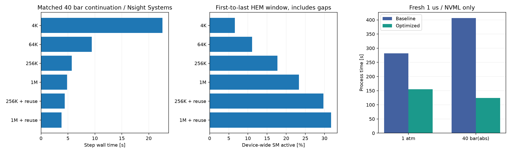

# HEM GPU 활용도 최적화 및 검증

2026-09-24. 이전 160³ GPU 계측에서 확인한 작은 순차 배치와 열역학 작업 불균형을 대상으로 개선했다. 물리 모듈, FP64 정밀도, EOS, 비선형 수렴 허용오차와 적응 시간 간격은 유지했다.

## 변경 내용

1. N₂O 메시 시리즈 생성기의 HEM 배치 기본값을 **4096 → 최대 1,048,576셀**로 확대했다. 메시가 작으면 실제 셀 수로 제한한다. 배치 메모리 예산도 함께 조정하며 기존 장치/호스트 메모리 검사를 유지한다. `--thermo-batch-cells`로 변경 가능하다.
2. **표면장력을 포함한 정확한 배치 내 재사용**을 구현했다. 종별 밀도, bulk 내부에너지, 전체 열역학 seed, 색 함수, 압력 점프의 모든 바이트가 같은 경우에만 한 번 계산한다. 평형/동결 모드는 배치 전체에서 동일하고 해시 테이블을 매 호출 비운다. 해시 충돌 시 원문 바이트를 재비교한다. 근사 오차로 유사 상태를 묶지 않는다.
3. CUDA capillary 회복에서 `thermoExactReuse true`를 허용하고 생성기 기본값으로 켰다. 유일한 상태는 기존 CUDA HEM으로 계산하고 결과를 원래 셀 위치에 돌려놓는다. 실패 시 배치 출력을 커밋하지 않는 동작을 유지했다.
4. 동결 회복도 읽기 전용 `q`를 받는 API 계약에 맞게 불필요한 재쓰기를 제거했다. OS에서 읽기 전용으로 매핑한 입력으로 회귀 검증했다.

재사용 키 생성은 이미 호스트에 있는 입력에서 수행한다. GPU 물성을 CPU에서 대신 계산하는 경로가 아니다. GPU HEM/수송 라이브러리의 바이너리는 그대로이며, 회복 풀과 솔버의 옵션 검사를 변경했다. 고체·승화·연소·분자 종 확산은 이전과 같이 꺼져 있고, flashing·과냉각 액체·점성·열전도·WALE·난류 혼합·표면장력은 유지했다.

## 중간 계측: 같은 1 μs 상태에서 다음 한 스텝

40 bar(abs)의 **동일한 저장 상태**, 동일 Δt=51.5925266857 ns로 비교했다. 모든 행은 Nsight Systems CUDA/API/메모리 추적, GPU 하드웨어 지표 1 kHz, NVML 0.5초 샘플을 같은 설정으로 수집했다.

| 배치 셀 수 | 정확 재사용 | 스텝 시간 | HEM 커널 시간¹ | GPU 제출 상태 | SM 활성² |
|---|---|---:|---:|---:|---:|
| 4096 | 끔 | 22.567 s | 19.357 s | 8,192,000 | 6.57% |
| 65,536 | 끔 | 9.438 s | 6.237 s | 8,192,000 | 11.11% |
| 262,144 | 끔 | 5.688 s | 2.375 s | 8,192,000 | 17.70% |
| 1,048,576 | 끔 | 4.819 s | 1.387 s | 8,192,000 | 23.33% |
| 262,144 | 켬 | 4.406 s | 1.421 s | 33,902 | 29.72% |
| **1,048,576** | **켬** | **3.815 s** | **0.761 s** | **33,865** | **31.75%** |

¹ HEM CUDA event 프로파일의 커널+카운터 reduction 범위다. Nsight의 `hemKernel` 단독 합과 약간 다르다.

² **첫 HEM 시작~마지막 HEM 종료의 연속 구간에서 장치 전체 SM 활성 평균**이다. 중간의 호스트 처리·수송·복사를 포함하며, 개별 커널의 achieved occupancy와 다르다.

배치만 변경한 첫 네 행은 phase/residual/Jacobian 등 연산 카운터까지 정확히 같다. 최종 여섯 행 모두 conserved q, 열역학 state, 시간/보존량 이력을 포함한 `reactiveState.bin` SHA256이 같다:

`9a8c6b2a61279c788c5e8a9c3815aac78cc4ab1fc6f871ac3395db381c17fe12`

최종 후보의 스텝은 기준 대비 **5.91배**, HEM event 커널 시간은 **25.44배** 빨라졌다. 순수 배치 확대로 동시 작업이 늘고, 재사용으로 반복되는 대기 기체 평가를 제거한 효과가 함께 있다. 재사용은 제출 상태의 99.59%를 줄였지만 어려운 셀의 반복 계산 대부분은 남는다. 40 bar FD Jacobian은 2,369,156 → 2,366,623, residual 평가도 52,017,075 → 51,970,965로 거의 유지된다. 따라서 제출 상태 감소율을 전체 연산 절감률로 사용하지 않는다.

첫~마지막 HEM 구간 보드 전력은 평균 약 100.69 → 117.23 W였다. 전체 프로세스의 GPU busy 비율은 고정적인 초기화·출력 구간 때문에 오히려 낮아질 수 있다. 이를 연산 효율 악화로 해석하지 않는다.

## Nsight Compute 재검사

추가 replay 계측으로 큰 배치의 실제 커널 자원 활용을 확인했다. 일반 대기 기체 호출은 4096셀/64블록에서 1,048,576셀/16,384블록으로 바뀌었다.

4096셀 참조는 [기존 40 bar NCU 원자료](../results/benchmarks/impinging-cube80-n160-gpu-profile-20260923/ncu-ambient_40bar_abs/kernel-summary.json)다. 동일한 원본 1 μs 체크포인트에서 이어지는 대표 호출이며 GPU HEM 바이너리는 바뀌지 않았다. 실제 커널 입력 범위와 replay/cache 상태가 달라 완전한 단일 변수 microbenchmark로 취급하지 않는다.

| HEM 대표 호출 | 원래 4096셀 | 큰 배치, 재사용 끔 |
|---|---:|---:|
| 일반 기체 achieved occupancy | 4.17% | 16.42% |
| 일반 기체 FP64 pipe, elapsed 기준 | 28.59% | 78.36% |
| 일반 기체 DRAM | 25.65 GB/s | 253.04 GB/s |
| 어려운 셀 포함 배치 occupancy | 3.93% | 11.15% |
| 어려운 셀 포함 배치 FP64 pipe | 3.16% | 31.53% |

배치가 커지면 해당 호출에 포함되는 셀 집합도 커진다. 이 표의 커널 duration을 직접 나누어 솔버 속도 향상을 주장하지 않는다. 일반 기체는 충분한 grid로 레지스터 자원에 따른 이론 점유율 16.67%에 가까워졌다. 255 registers/thread와 큰 로컬 스택은 이번에 바꾸지 않았다.

재사용을 켜면 첫 일반 기체 배치는 **대표 상태 1개/1블록**으로 줄고 약 0.270 ms가 된다. 이 호출의 낮은 점유율은 제거된 중복 작업의 결과다. 어려운 셀을 포함한 대표 배치는 **157블록**, achieved occupancy **6.03%**, FP64 pipe **42.37%**, SM active cycles/elapsed의 평균 **76.01%**였다. 큰 배치에서 쉬운 중복 입력을 제거하자 남은 어려운 계산에 GPU 시간을 더 집중했다. 줄어든 grid 때문에 occupancy 자체는 재사용 OFF보다 낮을 수 있다. 이를 단독 성능 목표로 삼지 않는다.

NCU는 replay용 메모리를 호스트에 백업한다는 경고를 남겼다. 이는 프로파일러의 저장·복원이며 물리 계산의 CPU 폴백이 아니다. 이 실행의 벽시계 시간은 성능 비교에 사용하지 않는다. 카운터 수집 완료·유한값과 한 스텝 정상 종료를 검증했다. 입력 배치/재사용에 따른 실제 workload 차이를 각 실행 정의에 남겼다.

재사용 ON의 어려운 배치에서 L2 hit raw 값은 100.58%였다. replay pass 간 변동을 포함한 범위 밖 값이므로 정확한 적중 확률로 사용하지 않았고, 원자료를 보존했다.

## 전체 160³ 0→1 μs 확인

기존 비계측/계측 결과를 섞지 않고 **이번 최적화 캠페인 안에서 기준과 후보를 새로 실행**했다. 아래는 NVML 모니터만 켰으며 Nsight Systems/Compute를 켜지 않은 별도 비교다. 양쪽은 같은 새 솔버/백엔드 바이너리, 같은 초기 primitive 입력에서 시작한다.

| 환경 | 스텝 수 | 기준 전체 시간 | 최적화 전체 시간 | 전체 가속률 | 스텝 시간 합: 기준 → 최적화 |
|---|---:|---:|---:|---:|---:|
| 대기압 | 23 | 281.82 s | **155.19 s** | **1.82배** | 230.695 → 104.189 s |
| 40 bar(abs) | 20 | 406.26 s | **124.39 s** | **3.27배** | 354.906 → 73.291 s |

기준과 최적화의 초기 입력은 같으며, 설정 차이는 배치 크기·정확 재사용·배치 메모리 예산 세 항목뿐이다. 각 쌍의 적응 Δt·시각·재시도 이력과 최종 체크포인트가 정확히 같다. 표면장력 결합의 내부 반복 횟수도 대기압 93회, 40 bar 41회로 유지됐다(회복 호출은 각각 48회/41회). 모든 실행에서 CPU 폴백 및 장치 실패는 0회였으며 최대 보존 잔차는 대기압 약 3.49×10⁻¹², 40 bar 약 6.91×10⁻¹⁴였다.

| 최종 체크포인트 SHA256 | 값 |
|---|---|
| 대기압 기준=최적화 | `80a06405af6ec70e31eee45023562ebc247d3431540198eda556c0ac24bf02f2` |
| 40 bar 기준=최적화 | `5d90ac770801c7bdc5ed07d52478e4f9679c83cc51d44db356f02d1843244e23` |

열역학 회복 전체 시간은 대기압 **190.768 → 63.822 s**, 40 bar **320.333 → 38.981 s**로 줄었다. HEM event 커널+reduction 누적은 각각 136.547 → 14.444 s, 293.596 → 13.856 s다. GPU 제출 상태는 대기압 380,928,000 → 1,027,765개, 40 bar 167,936,000 → 401,439개로 줄었다. 복사량도 각각 163.04 → 0.440 GB, 71.88 → 0.172 GB로 감소했다.

최적화 후 전체 프로세스 시간에서 각 주요 구간이 차지하는 비중은 다음과 같다. 회복 행에는 GPU 연산뿐 아니라 상태 준비·재사용 분류·결과 반영과 계면 결합 작업이 함께 포함된다.

| 최적화 실행 구간 | 대기압 | 40 bar(abs) |
|---|---:|---:|
| 열역학 회복 | 63.82 s (41.1%) | 38.98 s (31.3%) |
| 수송 | 18.79 s (12.1%) | 16.09 s (12.9%) |
| CFL/시간 간격 계산 | 13.31 s (8.6%) | 11.39 s (9.2%) |
| 상태 백업 | 7.08 s (4.6%) | 5.86 s (4.7%) |
| 보존량·진단·기타 스텝 작업 | 1.18 s (0.8%) | 0.98 s (0.8%) |
| 스텝 계측 밖: 초기화·출력 등 | 51.00 s (32.9%) | 51.10 s (41.1%) |

마지막 행은 프로세스 시간에서 스텝 합을 뺀 값으로, 이를 전부 파일 I/O나 CPU 계산으로 단정하지 않는다. 정밀한 내부 분해 없이 큰 HEM 가속률을 전체 실행 가속률로 옮겨 쓸 수 없다. 재사용 분류 자체의 호스트 비용도 대기압 7.96 s, 40 bar 3.53 s로 남아 있다(회복 시간에 포함). 다음 병목은 회복의 호스트 처리, 수송·CFL 및 스텝 밖 고정 비용이다.



## 정확성, 메모리와 적용 방법

소형 GPU 회귀는 평형·동결 중복 상태, q/E/seed/color/jump의 1 ULP 차이, 서로 다른 계면 상태의 원래 순서 복원, 중복 실패 시 원자성, 오래된 배치 토큰 거부, 읽기 전용 q를 검증했다. **10/10 통과**했으며 재사용 전후 전체 state 바이트와 실제 GPU 제출 상태 수를 확인했다. 기존 곡면 UV/flashing/부분 엔탈피 검증도 **20/20 통과**했다. CPU 폴백은 금지한 채 검증했다.

배치 확대는 더 많은 메모리를 예약한다. 이번 1,048,576셀 설정의 HEM device buffer는 약 **507.56 MB**이며 원래 4096셀의 약 2.03 MB보다 크다. 작은 장치/호스트에서는 `thermoBatchCells`를 낮춰야 한다. 배치마다 실제 제출 상태가 줄어도 예약 용량이 자동으로 줄지는 않는다.

전체 1 μs 실행의 프로세스 최대 RSS는 두 환경 모두 약 **9.05 → 10.43 GiB**였다. NVML로 샘플한 장치 전체 VRAM 최대는 대기압 7.96 → 8.45 GiB, 40 bar 7.98 → 8.46 GiB였다. 후자는 솔버 외 장치 사용량도 포함하고 0.5초 간격으로 측정했으므로 순간 최대 메모리의 정확한 값은 아니다.

생성기 기본값은 최종 후보이며, 기준 비교는 다음 옵션으로 재현한다.

```bash
--thermo-batch-cells 4096 --disable-thermo-exact-reuse
```

기존 N₂O capillary 케이스에는 다음 값을 사용한다. 물리 옵션과 시간 간격 설정은 유지한다.

```text
thermoBatchCells 1048576;
thermoExactReuse true;
maxThermoBatchMemoryMB 2097.152;
```

정적 액적의 작은 수렴 문제, 새로운 물리 모델, 혼합 정밀도 또는 CUDA 함수 내부의 근사 단축은 이번 범위에 포함하지 않았다. 각 설정은 1회 측정했으므로 반복 측정의 신뢰구간을 제시하지 않는다. 단일 하드웨어·초기 1 μs에서의 효과이며 발달한 충돌류 전체에 같은 가속률을 보장하지 않는다.

자료: [집계 및 재현 안내](../results/benchmarks/hem-utilization-optimization-20260924/README.ko.md), [검증된 수치](../results/benchmarks/hem-utilization-optimization-20260924/summary.json).

코드: [정확 키](../src/reactiveThermo/reactiveClosurePool.inc), [솔버 옵션](../src/reactiveFoam/ReactiveFoam.C), [원자적 회복 풀](../src/reactiveThermo/reactivePool.inc), [회귀 검증](../tools/validate_capillary_reuse.py), [실행 도구](../tools/benchmark_hem_optimization.py), [집계 도구](../tools/summarize_hem_optimization.py).
