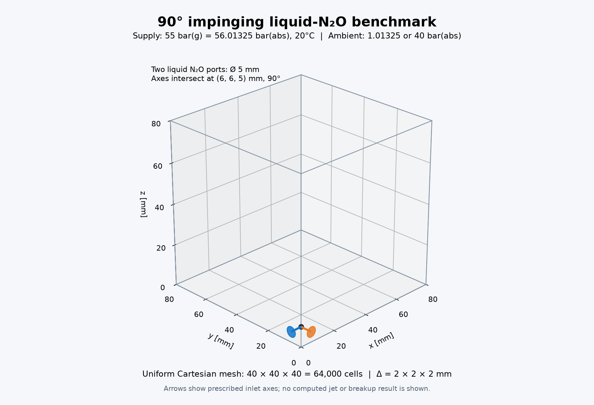

# N₂O 충돌 벤치마크 — 80 mm 정육면체 초기 GPU 비용 검사

사용자 요청에 따라 정적 액적의 작은 수렴 문제는 이번 작업에서 보류했다. 80×80×80 mm 영역을 40³·80³·160³ 정육면체 셀로 나누고, 지름 5 mm 원형 입구 두 개를 90도로 배치했다. **두 환경 × 세 메시, 총 6개 케이스에서 30 ns 초기 스텝을 모두 통과했다.** 각 케이스는 한 번만 실행했으며, 물리 코드나 수렴 판정은 변경하지 않았다.

## 조건과 메시

두 입구의 위치 (0,6,5)·(6,0,5) mm와 축 교점 (6,6,5) mm를 유지했다. 공급은 20°C 액체 N₂O, 55 bar(g)=56.01325 bar(abs), 환경은 20°C 공기(N₂/O₂ 몰비 79/21), 1.01325 또는 40 bar(abs)다. 기존 정지 저장조 fixedState 경계와 공급판 slipWall을 유지했다. 노즐 내부 및 초킹 유량을 해상한 모델은 아니다.

| 메시 | 셀 수 | 셀 변 길이 | 입구당 경계 면 | 입구 면적 | 이론 원 면적 대비 오차 |
|---|---:|---:|---:|---:|---:|
| 40³ | 64,000 | 2 mm | 6 | 24 mm² | +22.23% |
| 80³ | 512,000 | 1 mm | 16 | 16 mm² | -18.51% |
| 160³ | 4,096,000 | 0.5 mm | 80 | 20 mm² | +1.86% |

정육면체 셀을 유지하기 위해 중심이 원 내부에 있는 경계 면을 입구로 선택했다. 40³·80³에서는 원의 근사가 거칠고 입구 면적도 다르므로, 이 세 케이스를 동일 유량의 공간 수렴 시험으로 해석해서는 안 된다. 160³은 지름당 10셀이다. 모든 메시가 OpenFOAM `checkMesh -allGeometry -allTopology`와 별도 격자·입구 법선·마스크 검사를 통과했다.



## 활성 물리와 실행 경로

상평형 flashing, 과냉각 액체, 점성(1.821e-5 Pa·s), 열전도(0.02587 W/m/K), WALE 응력, 난류 열·종 혼합, 표면장력(0.0020577273399028486 N/m)을 유지했다. 계면은 기존 `diffuse-liquid-inventory-v1`이다. 고체·승화·연소·분자 종 확산은 껐다. 새 `cartesianImplicit`의 정적 액적 수렴 문제는 이 실행에 포함하지 않았다.

수송·열역학·표면장력 기하/유량·WALE PR 물성은 CUDA 경로를 사용했다. 여섯 실행 모두 HEM CPU fallback=0, GPU failure=0, WALE PR failure=0, hostEnthalpyCells=0이다. CPU의 메시 처리·초기 TP 상태 준비·제어·보존 진단·파일 출력은 남아 있으므로 전체 프로세스가 GPU 전용이라는 뜻은 아니다.

160³을 위해 자원 상한을 `maxDeviceMemoryGB 12`, `maxHostMemoryGB 32`(십진 GB)로 설정했다. 상한은 할당량이 아니다. 수송 GPU 할당은 5.881 GB였고 전체 장치 점유의 관측 최대값은 7.715 GiB, 프로세스 RSS 최대값은 9.063 GiB였다. OOM이나 제한 초과는 없었다.

## 실제 측정

RTX 5080 16 GB, 단일 프로세스, 한 케이스씩 실행했다. 모든 dt=30 ns, 재시도=0이다. `스텝`은 솔버의 `REACTIVE_STEP seconds`, `전체`는 GNU time의 프로세스 경과 시간으로 초기화·최초/최종 체크포인트 저장을 포함한다. 단일 측정이며 반복 평균은 아니다.

| 메시 | 환경 | 스텝 | 전체 | 호스트 RSS 최대 | GPU 전체 점유 관측 최대 |
|---|---|---:|---:|---:|---:|
| 40³ | 1 atm | 0.059 s | 1.56 s | 0.660 GiB | 0.514 GiB |
| 40³ | 40 bar(abs) | 0.384 s | 1.55 s | 0.665 GiB | 1.246 GiB |
| 80³ | 1 atm | 0.459 s | 6.89 s | 1.598 GiB | 2.021 GiB |
| 80³ | 40 bar(abs) | 1.290 s | 7.72 s | 1.598 GiB | 2.014 GiB |
| 160³ | 1 atm | 3.686 s | 51.84 s | 9.062 GiB | 7.715 GiB |
| 160³ | 40 bar(abs) | 6.274 s | 54.99 s | 9.063 GiB | 7.715 GiB |

GPU 점유는 0.5초 간격 `nvidia-smi`의 장치 전체 값이다. 다른 프로세스와 CUDA/OpenFOAM 할당을 포함하며, 짧은 피크를 놓칠 수 있어 솔버 단독 최대 메모리로 간주하지 않는다.

## 스텝 시간 구성

중첩 항목을 다시 더하지 않고 상위 구간만 집계했다. `복원`에는 GPU 열역학 복원 외에도 배치 준비·복사·계면/물성 갱신 등의 비용이 포함된다.

| 메시/환경 | 열역학 복원 및 연계 | 수송 | CFL | 백업 | 보존·진단·기타 |
|---|---:|---:|---:|---:|---:|
| 40³ / 1 atm | 0.033 s (56.1%) | 0.012 s (19.7%) | 0.009 s (14.5%) | 0.005 s (8.5%) | 0.001 s (1.2%) |
| 40³ / 40 bar | 0.359 s (93.3%) | 0.012 s (3.1%) | 0.009 s (2.3%) | 0.005 s (1.3%) | 0.001 s (0.1%) |
| 80³ / 1 atm | 0.243 s (53.0%) | 0.097 s (21.2%) | 0.074 s (16.2%) | 0.038 s (8.3%) | 0.006 s (1.3%) |
| 80³ / 40 bar | 1.079 s (83.6%) | 0.099 s (7.7%) | 0.071 s (5.5%) | 0.035 s (2.7%) | 0.006 s (0.5%) |
| 160³ / 1 atm | 1.957 s (53.1%) | 0.797 s (21.6%) | 0.588 s (16.0%) | 0.291 s (7.9%) | 0.053 s (1.4%) |
| 160³ / 40 bar | 4.582 s (73.0%) | 0.799 s (12.7%) | 0.564 s (9.0%) | 0.278 s (4.4%) | 0.051 s (0.8%) |

대기압 스텝 시간은 셀 수가 8배씩 증가할 때 7.74배·8.03배 증가했다. 이 초기 조건에서는 비선형적인 연산량 폭증이 나타나지 않았다. 40 bar 환경은 열역학 탐색 비용이 더 크며, 160³에서 복원 구간은 스텝의 73.0%다.

| 메시/환경 | GPU HEM 복원 상태 수 | 상 물성 평가 | FD Jacobian | HEM GPU kernel 시간 |
|---|---:|---:|---:|---:|
| 40³ / 1 atm | 128,000 | 512,680 | 0 | 0.013 s |
| 40³ / 40 bar | 128,000 | 571,256 | 4,528 | 0.338 s |
| 80³ / 1 atm | 1,024,000 | 4,097,792 | 0 | 0.075 s |
| 80³ / 40 bar | 1,024,000 | 4,232,624 | 10,448 | 0.909 s |
| 160³ / 1 atm | 8,192,000 | 32,776,928 | 0 | 0.562 s |
| 160³ / 40 bar | 8,192,000 | 33,352,928 | 44,680 | 3.227 s |

160³의 30 ns 스텝에서 HEM 복원은 8,192,000개 상태를 처리했다. WALE 물성은 프로세스 전체에서 24,576,000셀, 표면장력 기하 12회/유량 면 24,729,600개를 처리했다. 이 카운터에는 시작/출력 준비가 포함될 수 있어 GPU HEM 스텝 카운터와 범위가 같지 않다.

전체 프로세스에서 스텝 밖 시간은 160³ 대기압 48.15초(92.9%), 40 bar 48.72초(88.6%)다. 현재 계측만으로 이 시간을 초기화·메시·체크포인트별로 더 나누지는 않았다. 따라서 전체 약 52–55초를 매 스텝 비용으로 사용하면 안 된다.

## 검증 범위와 해석

여섯 케이스의 질량·에너지·종·원소 정규화 수지 잔차 최대값은 1.060e-13로 기준 1e-8 이내였다. 체크포인트 manifest·해시·레이아웃·양의 상 질량 및 N₂O 유입을 검증했다. 액체 질량은 상변화 원천항이 있으므로 전체 보존 수지와 별도로 기록했다.

**첫 스텝 종료 시 모든 케이스에서 계산 영역 내 액체 N₂O 질량은 0이고 유입 N₂O는 기체로 분배됐다.** 초기 공기에 극소량의 N₂O가 섞인 30 ns 상태다. 표면장력·난류 모델을 켜고 해당 경로를 실행한 사실이 발달한 액주·액막·액적의 비용 또는 정확도 검증을 뜻하지는 않는다. 이후 액체가 유지되고 계면과 flashing이 발달하면 비용이 달라질 수 있다. 장시간 비용으로 외삽하거나 충돌/분열 완료로 판정하지 않았다.

최저 온도는 대기압 40³/80³/160³에서 252.89/219.37/169.17 K였다. 148 K 모델 하한 침범은 없었다. dt=30 ns를 모든 메시에서 유지했으므로 이번 초기 스텝에서는 짧은 dt나 메시 품질 문제가 나타나지 않았다.

## 입력·결과와 재현

실제 케이스: `/home/jsw/문서/analysis/runs/impinging_n2o_cube80_20260923/n{40,80,160}/full-physics/{ambient_1atm,ambient_40bar_abs}`. `.foam` 파일로 열 수 있다. `base` 폴더는 물리를 추가하기 전 준비용이며 실행 대상이 아니다.

[요약 JSON](../results/benchmarks/impinging-cube80-20260923/summary.json)에 바이너리·소스 해시, 모든 계측값 및 케이스 경로를 보존했다. 같은 결과 폴더에 여섯 solver log, GNU time 결과, 입력 정의, 세 메시 검사 및 전체 검증 JSON을 함께 저장했다.

```bash
export PINTLE_SPUMA_ENV=/home/jsw/cae-gpu-pr1-compatible/env.sh
export PINTLE_REACTIVE_PREFIX=/home/jsw/문서/analysis/spuma-multiphysics/research/reactive-env
"$PINTLE_REACTIVE_PREFIX/bin/python" tools/prepare_impinging_resolution_series.py /path/to/new-series --inlet-z-mm 5 --max-delta-t 3e-8
"$PINTLE_REACTIVE_PREFIX/bin/python" tools/validate_impinging_initial_steps.py \
  /path/to/new-series/n40/full-physics/ambient_1atm \
  /path/to/new-series/n40/full-physics/ambient_40bar_abs \
  --timeout 300 --output /path/to/new-series/n40/initial-steps.json
```

80·160도 각각 동일하게 지정한다. 실행기는 기존 solver.log가 있으면 재실행을 거부하며, `maxAcceptedSteps 1`을 요구한다. 이번 작업에서 실제 물리 솔버 바이너리는 재빌드하지 않았다. 핵심 변경은 메인 에이전트가 작성했고, GPT-6 Sol xHigh 서브에이전트는 읽기 전용 코드·결과 검토를 담당했다.
