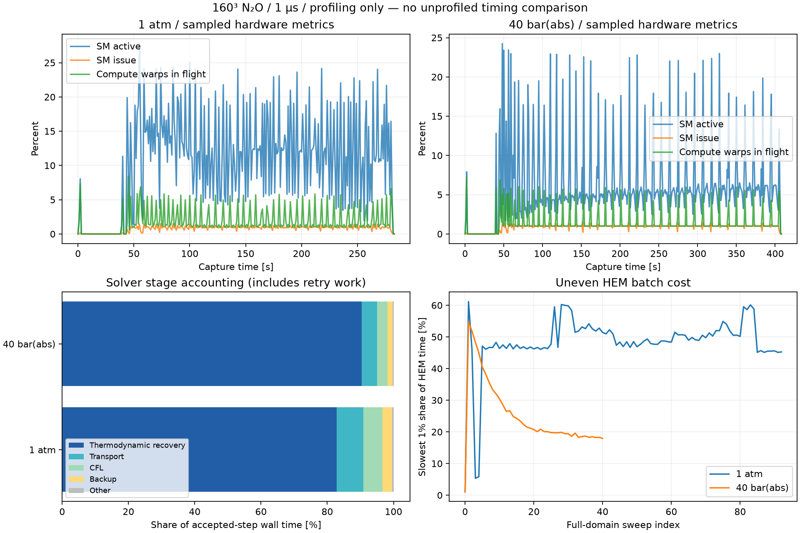
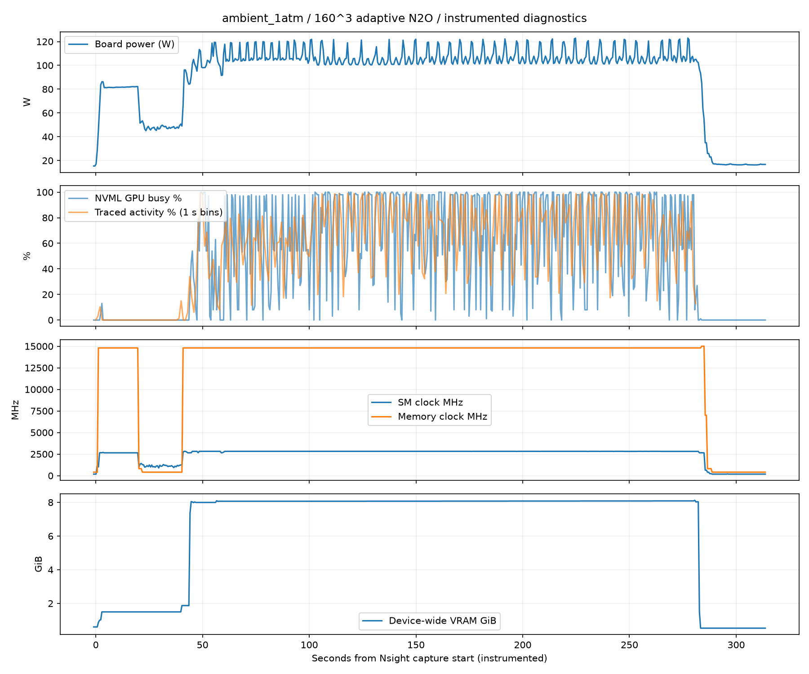
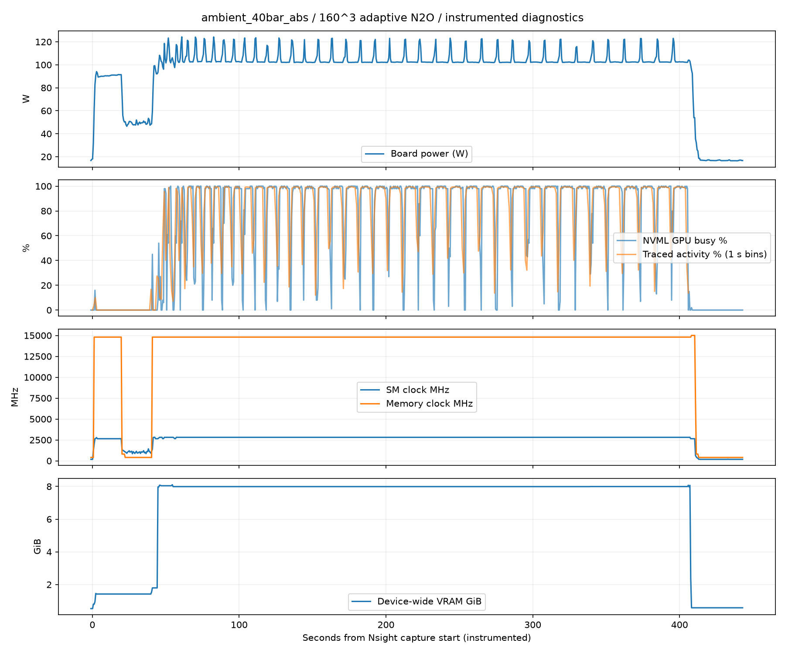

# 160³ N₂O 충돌 벤치마크 — GPU 세부 계측

측정 2026-09-23~24, 정리 2026-09-24. **대기압·40 bar(abs) 모두 1 μs 도달 및 검증 통과.**

지배적인 문제는 **HEM 열역학 회복의 작은 순차 배치와 셀별 작업량 불균형**이다. 전체 GPU 커널 시간 중 `hemKernel`의 비중은 대기압 93.99%, 40 bar 97.58%다. 느린 배치에서는 대부분의 SM이 먼저 종료하고 일부 SM에서 긴 반복 계산이 이어진다. 전체 장치의 DRAM 대역폭 포화나 전력 제한으로 설명되는 양상은 아니다.

WALE PR 물성 계산과 면 유량 계산은 FP64 파이프를 상당히 사용하지만 전체 시간에서 차지하는 비중이 작다. **연산량 자체를 줄이고 HEM 작업을 더 고르게 배분하는 것이 먼저**다. 이번 작업에서는 물리·정밀도·솔버 바이너리를 변경하지 않았다.

이 보고서의 시간은 모두 **계측이 켜진 실행의 시간**이다. 이전 40³·80³ 및 중단 전 결과와 속도 배율을 비교하지 않는다. 추가 Nsight Compute 실행 시간도 1 μs 벤치마크 시간에 합산하지 않는다.

## 1. 조건과 검증

80×80×80 mm 영역, 160³=4,096,000셀, 셀 변 0.5 mm. 원형 입구 지름 5 mm, 중심 (0,6,40)/(6,0,40) mm, +x/+y 방향 90도 충돌 구성을 유지했다. 경계 면 중심으로 원을 근사하며, 입구당 80면·20 mm²로 원 면적 대비 +1.86%다. 공급은 293.15 K 액체 N₂O, 55 bar(g)=56.01325 bar(abs). 외부는 293.15 K 공기, 1 atm 또는 40 bar(abs). 기존 정지 저장조 fixedState 경계를 유지했다.

상평형 flashing·과냉각 액체·점성·열전도·WALE 응력·난류 열/종 혼합·diffuse 표면장력이 켜져 있다. 고체·승화·연소·분자 종 확산은 꺼져 있다. `sigma=0.0020577273399028486 N/m`, `maxCo=0.25`, `maxDeltaT=1 μs`, 종료 1 μs. 각 스텝에서 현재 상태의 파동·확산·모세관 제한을 다시 계산한다. `thermoBatchCells=4096`, worker 1, 유한차분 Jacobian, `thermoExactReuse=false`, CUDA 열역학/수송, CPU 폴백 금지.

| 항목 | 대기압 | 40 bar(abs) |
|---|---:|---:|
| 종료 시간 | 1 μs | 1 μs |
| 수락 스텝 / 재시도 | 23 / 1 | 20 / 0 |
| 최종 정렬 스텝 제외 dt | 25.875–50.505 ns | 51.272–51.693 ns |
| 마지막 dt | 14.550 ns | 19.933 ns |
| 솔버 프로세스 시간, 계측 포함 | 282.88 s | 407.85 s |
| 수락 스텝 시간 합, 재시도 포함 | 231.032 s | 355.882 s |
| 계산 중 최저 온도 | 166.059 K | 258.489 K |
| 질량·에너지·종·원소 정규화 잔차 최대 | 3.49×10⁻¹² | 6.91×10⁻¹⁴ |
| GPU closure 실패 / CPU 폴백 | 0 / 0 | 0 / 0 |
| WALE 호스트 엔탈피 셀 | 0 | 0 |
| 최종 액체 N₂O 질량 | 2.206×10⁻⁷ kg | 0 kg |

허용 잔차 10⁻⁸, 체크포인트 시간·해시·종/상 재고를 검증했다. 40 bar의 최종 액체 질량 0은 이 시점의 계산 결과이며, 상변화 기능을 끈 것이 아니다. 첫 1 μs의 성능 측정으로, 발달한 충돌류나 액적 분열의 물리 수렴을 입증하는 시험은 아니다.

근거: [검증 및 물리 요약](../results/benchmarks/impinging-cube80-n160-gpu-profile-20260923/transient/summary.json), [전체 검증 기록](../results/benchmarks/impinging-cube80-n160-gpu-profile-20260923/transient/validation.json).

## 2. 측정 방법과 범위

- RTX 5080 / GB203 / CC 12.0 / 84 SM / 최대 48 warps·1536 threads/SM / 65,536개 32-bit 레지스터/SM. L2 64 MiB, 16 GB급 VRAM. 장치 API의 FP32:FP64 처리율 비는 64:1이다. [장치 조회](../results/benchmarks/impinging-cube80-n160-gpu-profile-20260923/device.json)
- 드라이버 595.91.07. 사용자 설정 변경 후 `RmProfilingAdminOnly=0`과 작은 NCU 실계측 성공을 확인했다. 드라이버·클럭·전력 제한은 이번 실행에서 변경하지 않았다.
- Nsight Systems 2026.2.1: CUDA API·커널·복사·할당·OS runtime 추적, gb20x 하드웨어 지표 1 kHz. NVML 전력·클럭·온도·PCIe·메모리 및 `/proc` CPU·RSS·I/O는 약 0.5초 간격.
- Nsight Compute 2026.1.0: 1 μs의 정확한 체크포인트를 별도 케이스로 복사해 한 스텝 진행. 각 주요 커널 첫 호출과 HEM 일반/느린 배치를 포함해 환경별 21개 호출을 계측했다. WALE의 실제 물성 경로를 추가 1개씩 측정해 **총 44개 호출**, 1,300개 이상의 metric 열을 보존했다. 커널당 약 35~37회 replay하며 cache/clock control은 `none`이다.
- HEM 느린 배치의 선택 근거는 원래 실행 마지막 1,000배치 sweep의 최장 배치: 대기압 507번, 40 bar 482번. 이후 한 스텝의 같은 셀 배치 번호를 측정했다. **원래 마지막 스텝과 동일한 입력을 재생한 수치가 아니라, 그 상태에서 이어지는 대표 측정**이다.
- CUDA kernel trace HEM 건수와 솔버의 누적 batch 카운터가 일치하고, trace dropped/overflow 경고는 없었다. 계측 continuation 네 케이스 모두 정상 한 스텝 완료, CPU 폴백 0, 필수 카운터 유한값 검증을 통과했다.

GPU 지표는 SM/SMSP·파이프·캐시·메모리 장치 단위다. 개별 CUDA ALU 코어별 사용률이나 각 캐시에 현재 점유된 바이트의 직접 계측값은 제공되지 않는다. CPU 하드웨어 샘플링은 `perf_event_paranoid=4` 때문에 사용하지 않았으며, CPU 사용·대기는 API 추적과 `/proc`로 확인했다. [NVIDIA 계측 지표 설명](https://docs.nvidia.com/nsight-compute/ProfilingGuide/)

trace 진단에는 NVTX 이벤트 없음, CPU scheduling 정보 없음, 실행용 부모 프로세스의 CUDA 이벤트 없음 경고가 있다. 실제 솔버 프로세스의 CUDA 이벤트는 양쪽 모두 수집됐고 HEM 호출 수도 일치한다. 따라서 NVTX 구간이나 정밀 CPU scheduling에 근거한 분석으로 확대하지 않았다.

## 3. 전체 시간을 어디에 쓰는가

아래 비율의 분모는 **솔버 프로세스 시간**이다. 단계별 시간은 중복 없이 합산했고, 스텝 외 시간은 프로세스 시간과 단계 합의 차이다.

| 구간 | 대기압 | 40 bar(abs) |
|---|---:|---:|
| 열역학 회복 | 191.283 s (67.62%) | 321.486 s (78.82%) |
| 수송 | 18.710 s (6.61%) | 16.490 s (4.04%) |
| CFL 계산 | 13.336 s (4.71%) | 11.360 s (2.79%) |
| 상태 백업 | 6.574 s (2.32%) | 5.579 s (1.37%) |
| 보존량 검사 | 0.422 s (0.15%) | 0.392 s (0.10%) |
| 진단 | 0.654 s (0.23%) | 0.574 s (0.14%) |
| 기타 스텝 처리 | 0.053 s (0.02%) | 0.001 s (0.00%) |
| 초기화·체크포인트 등 스텝 외 | 51.848 s (18.33%) | 51.968 s (12.74%) |

스텝 내부만 보면 열역학 회복은 **82.80% / 90.33%**다. 연소 source 시간은 0이다. 초기화·메시 처리·체크포인트를 포함하는 스텝 외 52초를 전부 파일 I/O라고 해석할 수는 없다.

GPU 커널만 분리하면 다음과 같다. 이 실행은 커널 실행 구간의 합과 합집합이 같아 커널 간 겹침이 없었다. API 대기 시간은 아래 시간과 겹치므로 더하지 않는다.

| GPU 커널 | 대기압 시간 (커널 합 대비) | 40 bar 시간 (커널 합 대비) |
|---|---:|---:|
| HEM `hemKernel` | 135.696 s (93.99%) | 293.254 s (97.58%) |
| `Advance` | 2.781 s (1.93%) | 2.416 s (0.80%) |
| WALE PR 물성 | 2.152 s (1.49%) | 1.847 s (0.61%) |
| `Faces` 면 유량 | 1.480 s (1.03%) | 1.263 s (0.42%) |
| 계면 gradient + curvature | 0.864 s (0.60%) | 0.585 s (0.19%) |
| 모든 커널 합 | 144.367 s | 300.531 s |
| GPU 복사 구간 합 | 13.787 s | 9.102 s |
| 커널·복사·memset 합집합 | 158.106 s | 309.571 s |

첫 GPU 활동부터 마지막 활동까지의 279.854/405.198초 중 추적된 GPU 활동 비율은 56.50%/76.40%다. 그 안의 활동 없는 구간은 121.748/95.628초이며 초기화·호스트 처리·출력·계측 등을 포함한다. 이를 전부 CPU 물리 계산이나 제거 가능한 오버헤드로 단정하지 않았다.

표면장력의 비용을 계면 gradient/curvature만으로 판단하면 안 된다. capillary 회복의 외부 반복이 HEM 호출을 추가하고, 면 유량·에너지와도 결합되어 있다. 점성·열전도·난류 혼합 역시 일부가 공통 면 유량에 포함된다. **물리 하나를 끌 때의 절감량은 이 계측만으로 독립 분해할 수 없다.**

전체 커널·API·전송 내역: [대기압](../results/benchmarks/impinging-cube80-n160-gpu-profile-20260923/ambient_1atm/summary.json), [40 bar](../results/benchmarks/impinging-cube80-n160-gpu-profile-20260923/ambient_40bar_abs/summary.json).

## 4. 전력·클럭·SM·메모리의 시간에 따른 상태

다음은 첫 HEM 시작부터 마지막 HEM 종료까지의 구간 평균이다. 이 구간에는 HEM 사이의 CPU 처리·수송·복사가 들어간다. NCU의 단일 커널 평균과는 분모가 다르다.

| 측정값 | 대기압 | 40 bar(abs) |
|---|---:|---:|
| NVML 보드 전력 평균 / 최대 | 107.08 / 122.94 W | 105.11 / 124.29 W |
| SM 클럭 평균 | 2817 MHz | 2811 MHz |
| 메모리 클럭 | 14801 MHz | 14801 MHz |
| 온도 최대 | 54°C | 57°C |
| SM 활성도 | 12.59% | 7.06% |
| SM 명령 발행률 | 0.95% | 0.98% |
| compute warps in flight | 2.13% | 1.60% |
| Tensor 활성도 | 0% | 0% |
| DRAM read / write 활성 비율 | 1.36 / 1.51% | 0.78 / 0.93% |
| PCIe RX / TX 지표 | 1.64 / 1.52% | 0.78 / 1.19% |

두 경우 모두 해당 구간의 샘플에서 clock event reason은 0, PCIe는 Gen5 x8이었다. 관측된 클럭과 제한 사유로 보면 전력/열 제한이 지배적인 원인이라는 증거는 없다. 이전에 관측한 65 W와 이번 값을 직접 성능 비교하지 않는다.

NVML GPU utilization은 커널이 하나라도 실행된 시간 비율이다. NVML memory utilization도 메모리 접근이 있던 시간 비율이다. 이것을 각각 모든 코어의 활용도나 최대 대역폭 대비율로 읽으면 안 된다. gb20x의 DRAM read/write 지표 역시 interface 활성 cycle 지표이며 GB/s는 아래 NCU에서 별도로 측정했다. [NVIDIA nvidia-smi 정의](https://docs.nvidia.com/deploy/nvidia-smi/), [Nsight Systems 지표](https://docs.nvidia.com/nsight-systems/UserGuide/)

## 5. HEM: 작은 grid와 오래 남는 일부 SM

현재 HEM은 4096셀마다 **64 blocks × 64 threads**, 셀당 한 스레드로 계산한다. 160³ 전체를 한 번 회복하는 데 1000배치가 필요하다. 배치를 순차 호출하고 결과를 호스트로 가져온 뒤 다음 배치로 넘어간다.

한 배치는 128 warps이며 전체 84×48=4032 warp 슬롯 대비 **3.17%가 절대적인 동시 수용량 상한**이다. 레지스터 255개/thread 때문에 충분히 큰 grid여도 레지스터 자원에 따른 이론 점유율은 약 16.67%다. 이는 실제 NCU achieved occupancy와 서로 다른 지표다.

| 대표 HEM 호출 | 일반 기체, 대기압 | 느린 배치, 대기압 | 일반 기체, 40 bar | 느린 배치, 40 bar |
|---|---:|---:|---:|---:|
| NCU duration | 0.269 ms | 51.858 ms | 0.268 ms | 180.788 ms |
| 활성 SM 기준 achieved occupancy | 4.17% | 4.11% | 4.17% | 3.93% |
| scheduler당 active / eligible warps | 1.00 / 0.08 | 1.00 / 0.08 | 1.00 / 0.08 | 1.00 / 0.08 |
| 장치 평균 FP64 pipe, elapsed 기준 | 28.52% | 0.66% | 28.59% | 3.16% |
| FP64 FLOP 수 | 48.36 M | 136.85 M | 48.36 M | 1473.52 M |
| FP32 FLOP 수 | 2.64 M | 7.53 M | 2.64 M | 79.81 M |
| DRAM bytes/s | 26.41 GB/s | 0.214 GB/s | 25.65 GB/s | 0.071 GB/s |
| L1 / L2 hit | 61.45 / 99.43% | 70.13 / ≈100% | 61.56 / 99.95% | 67.78 / ≈100% |
| 유효 lane 수 / warp 명령 | 31.44 | 19.74 | 31.45 | 12.54 |

NCU achieved occupancy의 분모는 활성 SM cycle이다. **약 4%를 전체 84 SM 점유율로 표현하지 않는다.** 느린 배치에서 SM active cycle 평균/최대는 대기압 2.41M/145.94M, 40 bar 41.93M/509.07M이며 최소는 모두 0이다. 최대 SM은 거의 전 구간 바쁘지만 장치 평균은 훨씬 낮다. 긴 일부 셀 계산이 배치 완료를 지연한다는 해석과 일치한다.

대기압 느린 HEM은 issued instruction당 fixed-latency `wait`가 9.25 cycles, short scoreboard 1.46, long scoreboard 0.71이었다. `eligible warps≈0.08`과 함께 보면 대기 중 실행할 다른 warp가 부족하다. 캐시 적중률이 높아도 연산 의존성과 반복 계산의 지연은 남는다.

원래 실행의 마지막 sweep에서 일반 배치 중앙값은 양쪽 모두 약 0.253 ms다. 최장 배치는 51.852/174.973 ms이며, 느린 1%가 HEM 시간의 45.27%/17.94%를 쓴다. NCU 대표 호출의 시간과 동일해야 하는 수치는 아니다. [배치 분포: 대기압](../results/benchmarks/impinging-cube80-n160-gpu-profile-20260923/ambient_1atm/hem-launch-groups.csv), [40 bar](../results/benchmarks/impinging-cube80-n160-gpu-profile-20260923/ambient_40bar_abs/hem-launch-groups.csv)

## 6. 정밀도·레지스터·캐시·물리 커널의 차이

| 커널, 대기압 대표 호출 | 레지스터/thread | 정적 stack/thread | achieved occupancy | FP64 pipe | DRAM | L1 / L2 hit |
|---|---:|---:|---:|---:|---:|---:|
| HEM | 255 | 6560 B | 약 4.1% | 배치별 0.66~28.52% | 위 표 | 위 표 |
| WALE PR 실제 물성 | 228 | 4480 B | 16.58% | 79.03% | 332.60 GB/s | 43.00 / 51.85% |
| `Faces` | 122 | 0 B | 32.81% | 86.68% | 127.30 GB/s | 80.47 / 79.07% |
| `Advance` | 92 | 648 B | 29.91% | 22.27% | 700.89 GB/s | 20.54 / 50.35% |
| `InterfaceGradient` | 38 | 0 B | 93.94% | 61.50% | 755.48 GB/s | 38.14 / 69.23% |
| `InterfaceCurvature` | 44 | 0 B | 78.95% | 82.76% | 741.79 GB/s | 55.56 / 68.73% |

WALE의 첫 호출은 단순 준비 경로로 약 0.35 ms여서 실제 물성 비용을 대표하지 않았다. 세 번째 호출을 따로 측정한 결과 대기압/40 bar **46.37/45.89 ms**, FP64 503.47/508.77 GFLOP/s, FP64 pipe 79.03/79.90%, DRAM 332.60/335.08 GB/s였다. WALE 엔탈피가 CPU에서 실행되기 때문에 느린 상태는 아니다.

FP64 FLOP은 동적 DADD+DMUL+2×DFMA, FP32도 같은 방식으로 집계했다. FP32 명령이 일부 있다고 물성을 FP32로 계산한다고 해석할 수는 없다. Tensor pipe는 계측 호출에서 0이었다. 정적 SASS의 일부 FP16 명령은 레지스터 초기화 등 컴파일러 구현에 사용되므로 FP16 물리 계산의 증거가 아니다.

HEM에는 실제 local load/store가 있다. 일반 기체 배치에서도 L1 local load/store 요청은 705,536/1,094,144 sectors, 느린 40 bar 배치는 29,839,375/50,202,421 sectors다. 이는 로컬 주소 공간 요청량으로 **DRAM 전송량이나 전부 register spill인 양으로 바꾸어 읽으면 안 된다.** 배열·스택도 포함된다. 큰 stack 예약량 역시 실제 캐시 점유량이 아니다.

캐시 처리량도 분리했다. 다음 L1/L2 값은 요청 sector를 32 B로 환산한 처리량으로, 유효 데이터 payload나 캐시 용량 점유율과는 다르다.

| 대표 호출 | L1 sector 환산 | L2 sector 환산 | DRAM read | DRAM write |
|---|---:|---:|---:|---:|
| 대기압 HEM 일반 | 251.49 GB/s | 179.23 GB/s | 1.736 GB/s | 24.678 GB/s |
| 대기압 HEM 느림 | 3.81 GB/s | 6.49 GB/s | 0.036 GB/s | 0.178 GB/s |
| 40 bar HEM 일반 | 252.15 GB/s | 179.05 GB/s | 2.293 GB/s | 23.355 GB/s |
| 40 bar HEM 느림 | 15.00 GB/s | 20.55 GB/s | 0.009 GB/s | 0.062 GB/s |
| 대기압 WALE 실제 물성 | 736.48 GB/s | 482.43 GB/s | 25.712 GB/s | 306.885 GB/s |
| 40 bar WALE 실제 물성 | 744.18 GB/s | 479.53 GB/s | 25.990 GB/s | 309.091 GB/s |

일부 커널은 대역폭을 잘 활용한다. 따라서 “이 솔버의 모든 연산이 대역폭과 무관하다”는 결론도 틀리다. 다만 전체 시간을 지배하는 느린 HEM 배치가 그와 다른 병목을 갖는다.

원자료: [전체 NCU 대기압](../results/benchmarks/impinging-cube80-n160-gpu-profile-20260923/ncu-ambient_1atm/all-counters.json), [전체 NCU 40 bar](../results/benchmarks/impinging-cube80-n160-gpu-profile-20260923/ncu-ambient_40bar_abs/all-counters.json), [WALE 대기압](../results/benchmarks/impinging-cube80-n160-gpu-profile-20260923/ncu-wale_1atm/kernel-summary.json), [WALE 40 bar](../results/benchmarks/impinging-cube80-n160-gpu-profile-20260923/ncu-wale_40bar/kernel-summary.json), [정적 자원](../results/benchmarks/impinging-cube80-n160-gpu-profile-20260923/resources.txt).

## 7. 메모리 점유·전송·CPU 대기

| 항목 | 대기압 | 40 bar(abs) |
|---|---:|---:|
| 장치 전체 VRAM 샘플 최대 | 8.122 GiB | 8.109 GiB |
| 솔버 RSS 최대, 계측 포함 | 10.164 GiB | 10.072 GiB |
| CUDA device allocation 최대 | 5.883 GB | 5.883 GB |
| managed allocation 최대 | 1.294 GB | 1.294 GB |
| transport device buffer 보고값 | 5.881 GB | 5.881 GB |
| HEM bridge device buffer | 2.030 MB | 2.030 MB |
| 전체 trace 복사 payload 누적 | 326.18 GB | 208.79 GB |
| HEM 자체 transferBytes 카운터 | 163.04 GB | 71.88 GB |

VRAM 샘플은 장치 전체 사용량이며 profiler·context 등이 포함된다. CUDA 할당 이벤트는 논리적 할당량이고 managed 메모리의 실제 GPU 상주량과 다르다. 이 값들을 더해 새로운 peak를 만들지 않았다. VRAM 부족·지속적 swap이 지배적인 징후는 없다.

HEM은 한 셀당 약 428 B와 배치당 48 B를 왕복한다. 한 전체 sweep은 약 1.753 GB다. 대기압은 누적 93 sweep, 40 bar는 41 sweep이며, 각 1 sweep은 스텝 전 초기 회복이다. 물성 계산 자체보다 왕복을 줄이는 것만으로 모든 시간이 해결되는 구조는 아니지만, 호스트 경유는 다음 배치의 시작을 직렬화한다.

대기압 `cudaMemcpyAsync` API 체류는 161.857초이나 그중 155.627초는 GPU 실행 구간과 겹친다. 40 bar도 310.465초 중 307.593초가 겹친다. **이를 순수 복사 시간으로 더하면 심한 중복 계산**이 된다. 실제 GPU 복사 구간 합은 13.787/9.102초다. pageable 버퍼의 D2H 호출에서 선행 커널 완료를 기다리는 경로가 있으며, CPU가 높은 사용률을 보이는 것과 물리 계산의 CPU 폴백은 다르다.

대기압 pageable H2D/D2H payload 처리율은 22.76/26.59 GB/s, pinned 경로는 26.35/28.41 GB/s였다. 이는 **전송 구간 안의 payload/시간**이며 GDDR7 DRAM 대역폭이 아니다. 실제 링크는 Gen5 x8이지만 현재 평균 PCIe 지표가 낮아 링크 폭 확대를 첫 해결책으로 볼 근거는 없다.

복사·API·할당 CSV와 압축된 원시 NVML/CPU 샘플은 각 환경 폴더에 보존했다.

## 8. 연산량 자체와 개선 순서

| HEM 누적 연산 | 대기압 | 40 bar(abs) |
|---|---:|---:|
| 제출 셀 수, 반복 포함 | 380,928,000 | 167,936,000 |
| phase evaluations | 1,549,562,806 | 1,043,835,821 |
| residual evaluations | 27,660,367 | 629,107,238 |
| 유한차분 Jacobian | 1,447,664 | 28,650,932 |
| analytic Jacobian | 0 | 0 |

40 bar는 HEM 제출 셀이 더 적어도 잔차·Jacobian 평가가 훨씬 많다. 유한차분 비선형 회복의 긴 계산과 작업 분배가 낮은 장치 활용도와 함께 나타난다. 높은 전력을 목표로 클럭이나 전력 상한만 바꿀 상황은 아니다.

1. **HEM 배치 확대와 작업량 분배부터 시험.** 현재 4096셀/64블록을 확대하고, 쉬운 단상 셀과 어려운 회복 셀을 더 큰 범위에서 분류·배분한다. 단순 배치 확대만으로 느린 일부 warp 문제까지 해결된다고 보장할 수 없으므로 평균 및 느린 배치 분포를 함께 확인해야 한다.
2. **반복 평가 횟수를 줄이는 열역학 경로 검증.** 현 케이스는 finiteDifference를 강제한다. 이미 있는 analytic Jacobian의 적용 범위·실패 조건을 검증하고, 동일 입력 재사용 및 단상 shortcut을 capillary 결합에도 안전하게 적용할 수 있는지 조사한다. 계면색·압력 점프 등 회복 입력까지 키에 포함해야 한다. 정확성 검증 없이 셀을 건너뛰면 안 된다.
3. **GPU 상주 데이터와 배치 간 중첩.** HEM 상태를 호스트로 왕복하는 경로, pageable D2H의 대기, 배치별 동기화를 줄인다. 독립 배치를 중첩하되 메모리 예산과 출력 순서/보존량을 검증한다.
4. **레지스터·로컬 배열 경량화.** HEM 255 regs/6560 B, WALE 228 regs/4480 B를 만든 큰 공용 함수와 배열을 세부 경로로 분리하는 후보가 있다. register cap을 강제로 낮추면 spill이 늘 수 있어 독립 검증이 필요하다.
5. **혼합 정밀도는 그 다음.** FP64 처리율 제약은 확인됐지만 느린 HEM의 전 장치 FP64 pipe도 낮다. 우선 병렬성과 중복 연산을 개선하고, EOS·평형·보존량 오차를 측정한 뒤 안전한 부분만 정밀도 변경을 검토한다. Tensor 사용을 켜는 단순 옵션으로 해결되는 알고리즘은 아니다.

계면 geometry나 WALE만 제거·최적화하는 것은 현재의 주 병목을 직접 해결하지 못한다. 표면장력 회복 반복의 간접 비용은 별도 실험이 필요하다. 이번에는 요청대로 계측·분석을 완료했으며 이러한 최적화나 물리 제거는 적용하지 않았다.

## 9. 해석 한계와 재현 자료

- 한 번씩 수행한 계측 실행이다. CPU telemetry·API 추적·GPU counter 수집 및 replay의 영향을 제거한 실사용 시간을 추정하지 않았다.
- NCU의 cache/clock control을 끈 여러 pass 측정에서 느린 HEM L2 hit raw 값이 100.15%/100.04%였다. 정확한 확률로 취급하지 않고 상한 근처로 해석했으며 원시값을 보존했다. WALE occupancy 16.71%가 이론 16.67%를 약간 넘는 값도 pass 간 변동/정규화 해상도를 고려해야 한다. [NVIDIA replay 및 범위 밖 지표 설명](https://docs.nvidia.com/nsight-compute/ProfilingGuide/)
- 활성 SM 기준 occupancy, 전체 장치 기준 SM active, 순간 사용 warp 상한, FP64 pipeline busy, FLOP/s는 서로 다른 지표다. 개별 코어·개별 cache line 점유율을 측정했다고 주장하지 않는다.
- 원래 정적 액적 수렴 문제나 장시간 충돌/분열 수렴 시험은 재개하지 않았다.

분석 스크립트: [profile_impinging_gpu.py](../tools/profile_impinging_gpu.py), [analyze_gpu_trace.py](../tools/analyze_gpu_trace.py), [profile_reactive_kernels.py](../tools/profile_reactive_kernels.py), [summarize_ncu_counters.py](../tools/summarize_ncu_counters.py).

전체 작은 결과 묶음은 [results/benchmarks/impinging-cube80-n160-gpu-profile-20260923](../results/benchmarks/impinging-cube80-n160-gpu-profile-20260923/README.ko.md)에 있다. 수백 MB의 SQLite·Nsight 원본과 체크포인트는 `/home/jsw/문서/analysis/runs/impinging_n2o_cube80_z40_counters_1us_20260923` 아래에 보존했다. 설정·실행 명령·로그·바이너리 해시를 함께 남겼다.

솔버 SHA256: `4f59195d821988335697c8a515a55ffc960da7442f77f91dadd8d1b803b44858`.
이번에 추가·수정한 것은 계측/분석 도구와 결과 자료이며, 솔버 바이너리는 변경하지 않았다. 원격 PR 병합이나 GitHub 게시를 수행하지 않았다.
