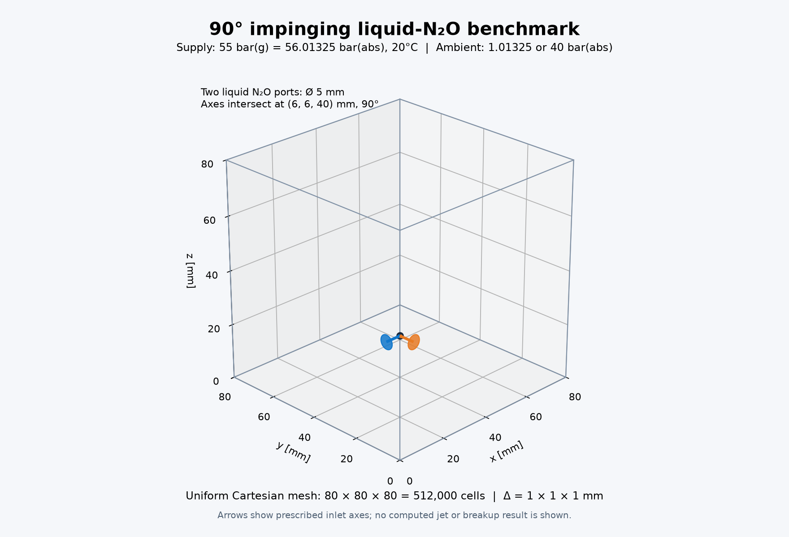
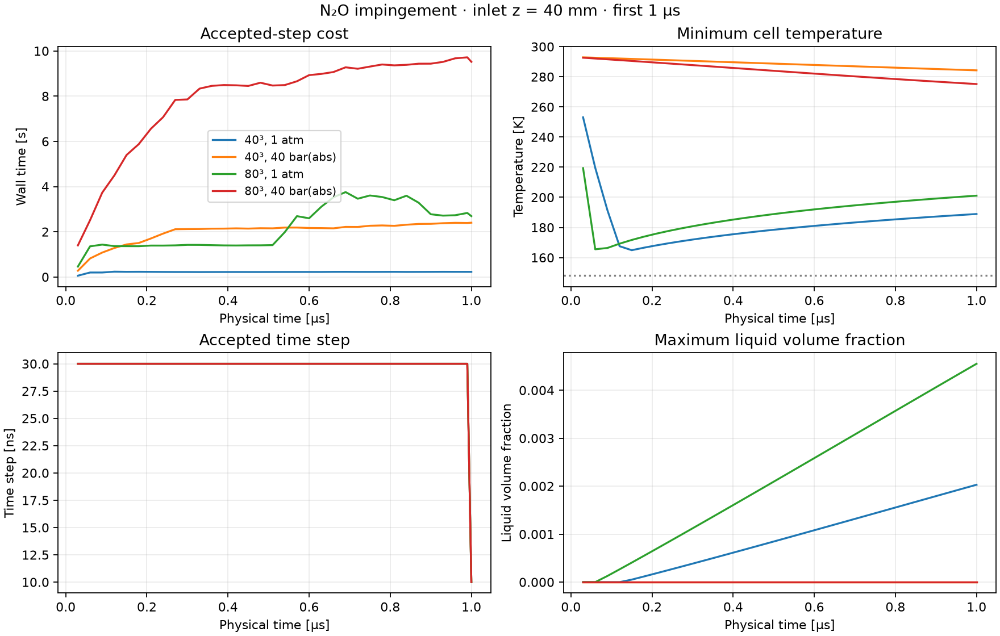

# N₂O 충돌 벤치마크 — 입구 z=40 mm, 1 μs GPU 실행

두 입구 중심을 **(0,6,40), (6,0,40) mm**로 옮겼다. 40³·80³ 메시와 대기압·40 bar(abs) 환경을 조합한 **네 케이스 모두 34스텝으로 1 μs까지 완료**했다. 재시도, GPU 실패, HEM CPU fallback, WALE 호스트 엔탈피 준비는 모두 0이다.

## 유지한 조건과 변경 범위

영역 80×80×80 mm, 지름 5 mm의 원형 공급구 두 개, 90도 분사축, 공급 20°C·55 bar(g)=56.01325 bar(abs), 환경 20°C 공기(N₂/O₂ 몰비 79/21)를 유지했다. 메시 셀 크기는 각각 2·1 mm다. 기존 정지 저장조 fixedState 경계와 slipWall 공급판을 사용한다.

상평형 flashing·과냉각 액체·점성·열전도·WALE 응력·난류 열 및 종 혼합·표면장력을 켰다. 기존 diffuse 계면, 상수 물성 및 표면장력 계수, CUDA 수송·열역학·WALE PR 물성 경로를 유지했다. 연소·고체·승화·분자 종 확산은 껐다. 물리 입력은 이전 케이스와 열역학 파일 경로를 제외하고 동일함을 비교 확인했다. 솔버 바이너리는 재빌드하지 않았고 정적 액적 수렴 문제나 최적화 작업은 진행하지 않았다.

새 위치에서 입구당 경계 면은 40³에서 4개, 80³에서 16개이며 두 메시의 실제 면적은 모두 16 mm²다. 원형 마스크를 정육면체 경계 면으로 근사한 결과로, 이론 면적 19.635 mm²보다 **18.51% 작다**. 입구 법선·중심·마스크와 모든 메시의 checkMesh 검사를 통과했다. 이전 z=5 mm의 40³ 입구 면적은 24 mm²였으므로 그 이전 결과와 유량을 직접 비교하면 안 된다.



## 실행 시간과 메모리

RTX 5080에서 케이스를 하나씩 한 번 실행했다. `전체`는 초기화·저장까지 포함한 프로세스 시간이고, `스텝 합계/평균/최대`는 솔버가 계측한 적분 구간이다. 마지막 스텝은 종료 시각 정렬을 위해 10 ns이며, 그 앞 33스텝은 모두 30 ns다. 짧아진 마지막 dt는 CFL 악화나 재시도 때문이 아니다.

| 메시 | 환경 | 전체 시간 | 스텝 합계 | 평균/최대 스텝 | 호스트 RSS 최대 | GPU 점유 관측 최대 |
|---|---|---:|---:|---:|---:|---:|
| 40³ | 1 atm | 8.65 s | 7.41 s | 0.218 / 0.235 s | 0.665 GiB | 1.316 GiB |
| 40³ | 40 bar(abs) | 69.13 s | 67.92 s | 1.998 / 2.401 s | 0.665 GiB | 1.275 GiB |
| 80³ | 1 atm | 81.81 s | 75.04 s | 2.207 / 3.755 s | 1.598 GiB | 2.025 GiB |
| 80³ | 40 bar(abs) | 276.18 s | 269.36 s | 7.922 / 9.717 s | 1.598 GiB | 2.018 GiB |

GPU 점유는 0.5초 간격으로 관측한 장치 전체 값이며, 솔버만의 메모리나 놓치지 않은 실제 피크를 뜻하지 않는다. 초기 상태 준비·메시·제어·파일 출력 등 CPU 작업도 남아 있다. 위 평균은 한 번의 실행 안에서 34스텝을 평균한 값이며, 반복 실행의 통계가 아니다.

## 병목과 시간 변화

| 메시/환경 | 복원 및 연계 비용 | 수송 | CFL | 백업·보존·진단·기타 | HEM GPU kernel 합계 |
|---|---:|---:|---:|---:|---:|
| 40³ / 1 atm | 6.64 s (89.5%) | 0.41 s (5.5%) | 0.30 s (4.0%) | 0.07 s (0.9%) | 5.44 s |
| 40³ / 40 bar | 67.15 s (98.9%) | 0.40 s (0.6%) | 0.30 s (0.4%) | 0.07 s (0.1%) | 66.40 s |
| 80³ / 1 atm | 67.77 s (90.3%) | 3.31 s (4.4%) | 2.43 s (3.2%) | 1.52 s (2.0%) | 57.96 s |
| 80³ / 40 bar | 262.26 s (97.4%) | 3.29 s (1.2%) | 2.41 s (0.9%) | 1.41 s (0.5%) | 256.40 s |

복원 구간은 GPU 열역학뿐 아니라 배치 준비·전송·계면 및 물성 갱신을 포함한다. HEM kernel 시간은 그 안에 중첩된 별도 계측이므로 다시 더하지 않는다. **40 bar 케이스의 병목은 열역학 복원**이며, 복원 구간이 적분 시간의 97–99%를 차지했다.

80³·40 bar의 스텝 시간은 첫 1.396초에서 마지막 9.519초로 증가했다(최대 9.717초). 해당 구간에서 GPU HEM 유한차분 Jacobian은 20,356,757회 수행됐다. 대기압 80³에서는 최대 3.755초 뒤 마지막 2.693초로 내려왔다. 첫 스텝만으로 전체 비용을 예측하기 어렵다는 점을 확인했으며, 자동 반복 실행이나 물리 축소·최적화는 하지 않았다.



그림의 회색 점선은 물성 모델의 148 K 하한이다. 액체 체적분율 곡선은 고체와 다른 액체가 없는 현재 모델에서 `1−min(alphaGas)`로 구했다. 동일한 dt 곡선은 서로 겹친다.

## 온도·상분배와 보존 검사

| 메시/환경 | 전체 구간 최저 온도 | 종료 시 최저 온도 | 종료 액체 N₂O 질량 | 종료 N₂O 기체 질량비 | 최대 액체 체적분율 |
|---|---:|---:|---:|---:|---:|
| 40³ / 1 atm | 164.91 K | 188.93 K | 0.1662 mg | 60.36% | 0.002030 |
| 40³ / 40 bar | 284.26 K | 284.26 K | 0.0000 mg | 100.00% | 0.000000 |
| 80³ / 1 atm | 165.52 K | 201.10 K | 0.1770 mg | 57.37% | 0.004553 |
| 80³ / 40 bar | 275.17 K | 275.17 K | 0.0000 mg | 100.00% | 0.000000 |

질량·에너지·종·원소 정규화 보존 수지 잔차의 전체 최대는 **4.856e-14**로 기준 1e-8 이내다. 모든 스텝의 수지를 확인했고, 최종 체크포인트의 시간·스텝 수·해시·상 질량·N₂O 유입 검사를 통과했다. 148 K 물성 하한 침범은 없었다.

대기압 케이스는 첫 스텝 이후 액체가 유지됐다. 40 bar 케이스는 현재 셀평균 HEM 모델에서 종료 시 N₂O가 전부 기체로 분배됐다. 이 결과는 1 μs 초기 과도 구간의 실행·상분배 결과이며, 발달한 액주 충돌·액적 생성의 정확도를 입증한 결과는 아니다.

## 파일과 재현

실제 케이스는 `/home/jsw/문서/analysis/runs/impinging_n2o_cube80_z40_1us_20260923/n{40,80}/full-physics/{ambient_1atm,ambient_40bar_abs}`에 있다. 각 `.foam` 파일을 열면 `1e-06` 최종장을 볼 수 있다. 이전 z=5 mm 케이스는 보존했다.

[요약 JSON](../results/benchmarks/impinging-cube80-z40-1us-20260923/summary.json), [전체 검증 JSON](../results/benchmarks/impinging-cube80-z40-1us-20260923/validation.json)과 같은 폴더의 로그·자원 계측·입력 정의·메시 검사를 함께 저장했다. 바이너리와 생성기 해시도 포함한다.

```bash
export PINTLE_SPUMA_ENV=/home/jsw/cae-gpu-pr1-compatible/env.sh
export PINTLE_REACTIVE_PREFIX=/home/jsw/문서/analysis/spuma-multiphysics/research/reactive-env
"$PINTLE_REACTIVE_PREFIX/bin/python" tools/prepare_impinging_resolution_series.py /path/to/new-series \
  --grids 40 80 --inlet-z-mm 40 --end-time 1e-6 --max-delta-t 3e-8
"$PINTLE_REACTIVE_PREFIX/bin/python" tools/validate_impinging_initial_steps.py \
  /path/to/new-series/n40/full-physics/ambient_1atm \
  /path/to/new-series/n40/full-physics/ambient_40bar_abs \
  /path/to/new-series/n80/full-physics/ambient_1atm \
  /path/to/new-series/n80/full-physics/ambient_40bar_abs \
  --end-time 1e-6 --timeout 900 --keep-going \
  --output /path/to/new-series/transient-validation.json
"$PINTLE_REACTIVE_PREFIX/bin/python" tools/summarize_impinging_transient.py \
  /path/to/new-series/transient-validation.json --output /path/to/new-results
```

`--keep-going`은 한 케이스 실패 시 독립된 다음 케이스를 실행하는 옵션이며 실패 케이스를 재실행하지 않는다. 이번 네 케이스는 모두 첫 실행에 성공했다. 코드는 메인 에이전트가 직접 수정했다.
