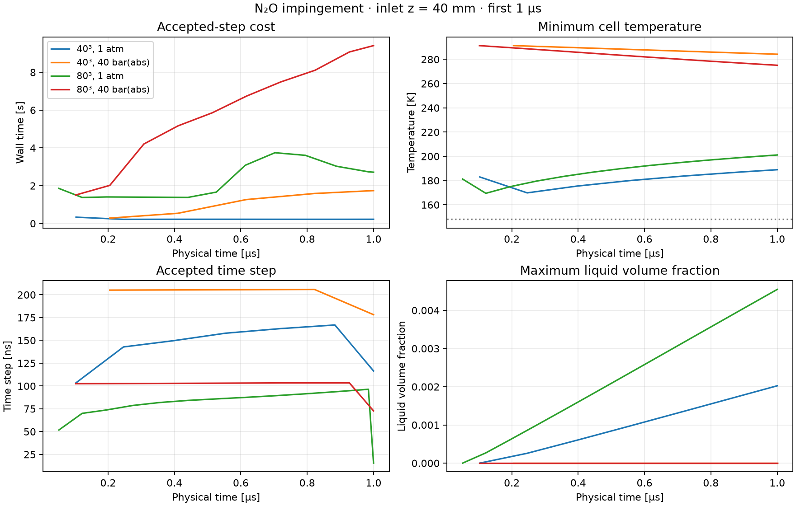

# N₂O 충돌 벤치마크 — CFL에 따른 dt, 1 μs 재실행

기존에는 매 스텝 CFL을 다시 계산하고 있었지만 **`maxDeltaT=30 ns` 상한**이 실제 dt를 제한했다. 상한을 **1 μs**로 올리고 `maxCo=0.25`와 모든 물리·경계·메시 설정을 유지해 네 케이스를 처음부터 한 번씩 다시 실행했다. 모두 목표 1 μs에 도달했고 최종 체크포인트·보존 검사를 통과했다.

## dt가 결정되는 방식

`ReactiveFoam.C`의 시간 루프는 각 스텝에서 현재 q와 열역학 상태를 `Flow::stableStep()`에 전달한다. 이 함수는 계면·속도·물성 상태를 GPU에 갱신한다. GPU는 모든 셀에 대해 면 속도 및 확산 제한과 모세관 제한을 계산하고 그 최솟값을 전역 dt로 선택한다.

```text
dt = min(maxDeltaT, 종료까지 남은 시간,
         모든 셀의 음향·이류·확산 CFL 제한, 모든 계면 셀의 모세관 제한)
```

단순 유속만 사용하는 조건이 아니다. 압축성 유동이므로 음속과 경계 ghost 상태가 포함되고, WALE를 포함한 확산 제한도 반영된다. 바깥 단계 선택은 `0.95 × maxCo`를 사용하며, 중간 RK 단계에서도 현재 상태의 CFL을 재검사한다. 반려 시 원래 상태로 돌아가 dt를 절반으로 줄인다. 모든 셀은 동일한 물리 시각을 공유하므로 가장 제한적인 셀이 전체 dt를 결정한다. 그 제한이 거의 변하지 않으면 적응형이어도 dt 변화가 작을 수 있다.

확인한 구현: [시간 루프](../src/reactiveFoam/ReactiveFoam.C), [GPU 시간 간격 연산자](../src/reactiveTransport/pintleTransportKernels.h), [GPU 최솟값 reduction](../src/reactiveTransport/pintleReactiveTransport.cpp). 새 적분기를 추가하거나 `adjustTimeStep` 같은 사용되지 않는 옵션을 넣지 않고 실제 읽는 `maxDeltaT` 설정을 바꿨다.

## 적용 설정과 실제 결과

입구 중심 (0,6,40)·(6,0,40) mm, 80 mm 정육면체 영역, 원형 지름 5 mm, 액체 N₂O 20°C·55 bar(g), 환경 1 atm·40 bar(abs)를 유지했다. Flashing·과냉각 액체·점성·열전도·WALE 열/종 혼합·표면장력을 켠 기존 diffuse 모델이다. 고체·승화·연소·분자 종 확산은 껐다. CPU fallback도 계속 금지했다.

```foam
maxCo          0.25;
maxDeltaT      1e-6;
endTime        1e-6;
maxAcceptedSteps 0;
```

이번 1 μs 구간에서 1 μs 상한 자체에 걸린 스텝은 없었다. 표의 dt 범위는 마지막 종료 시각 정렬 스텝을 제외한 승인된 값이며, 첫 단계의 CFL 재시도 결과는 포함한다.

| 메시/환경 | 스텝 수 | 실제 dt 범위 | 재시도 | 전체 시간: 이전 → 현재 | 실행 속도 향상 |
|---|---:|---:|---:|---:|---:|
| 40³ / 1 atm | 34 → 7 | 103.53–166.88 ns | 1 | 8.65 → 2.91 s | 2.97배 |
| 40³ / 40 bar | 34 → 5 | 205.09–205.86 ns | 0 | 69.13 → 6.63 s | 10.43배 |
| 80³ / 1 atm | 34 → 13 | 51.76–96.38 ns | 1 | 81.81 → 36.03 s | 2.27배 |
| 80³ / 40 bar | 34 → 10 | 102.54–103.39 ns | 0 | 276.18 → 66.29 s | 4.17배 |

전체 시간에는 초기화와 체크포인트 저장이 포함된다. 이전/현재 각 한 번의 측정으로, 반복 평균은 아니다. 솔버와 CUDA 라이브러리 바이너리 해시는 이전 실행과 동일하다. 설정의 열역학 파일 경로를 제외하고 물리 입력이 같고, 메시 정의도 같음을 확인했다.

대기압 두 메시에서 첫 시도만 `RK stage wave/diffusion CFL requires a smaller step` 사유로 한 번씩 반려됐다. 40³은 후보 207.05 ns를 103.53 ns로, 80³은 후보 103.52 ns를 51.76 ns로 줄여 통과했다. 열역학 GPU 실패나 CPU fallback에 의한 감소가 아니다. 이후에는 매 스텝 계산한 dt로 진행했다.

종료 시각에 맞춘 마지막 dt는 40³ 대기압/40 bar에서 116.51/178.17 ns, 80³에서 15.46/72.73 ns다. 이 마지막 스텝의 감소는 CFL 악화로 해석하면 안 된다.



## 메시 크기와 계산 시간

40³에서 80³으로 가면 셀 수는 8배(64,000 → 512,000), 셀 변 길이는 절반(2 → 1 mm)이 된다. 이번 실행의 스텝 수는 대기압 7 → 13회, 40 bar 5 → 10회로 약 두 배가 됐다. 하지만 GPU 처리량, 공간상으로 다른 상변화 상태, 열역학 반복 횟수, 초기화·출력 비용 때문에 전체 실행 시간이 셀 수×스텝 수에 정확히 비례하지는 않는다.

이전 30 ns 상한에서도 80³의 전체 시간은 40³보다 대기압 9.46배, 40 bar 4.00배였다. 이번에는 각각 12.38배·10.00배다.

| 메시/환경 | 적분 구간 합계 | 평균 스텝 | 복원 및 연계 비용 비중 | HEM GPU kernel 합계 |
|---|---:|---:|---:|---:|
| 40³ / 1 atm | 1.681 s | 0.240 s | 89.3% | 1.231 s |
| 40³ / 40 bar | 5.422 s | 1.084 s | 97.8% | 5.187 s |
| 80³ / 1 atm | 29.384 s | 2.260 s | 90.2% | 22.682 s |
| 80³ / 40 bar | 59.573 s | 5.957 s | 96.4% | 55.634 s |

계산 시간 감소는 주로 승인 스텝 수와 복원 호출 감소에 따른 결과다. 새 GPU 최적화나 물리 제거를 적용한 결과는 아니다. 각 승인 스텝 비용에는 반려된 RK 시도의 비용도 포함된다.

## 기존 30 ns 결과와 최종장 비교

같은 메시·같은 1 μs 시각의 저장장을 직접 비교했다. 전역 보존 수지 통과만으로 시간 정확도가 같다고 가정하지 않았다. 아래 q₂는 전체 N₂O 질량밀도이며, 상대 L1 차이는 `sum(abs(new−reference))/sum(abs(reference))`다.

| 메시/환경 | N₂O 밀도 상대 L1 차이 | 액체 N₂O 총질량 차이 | 최대 온도 차이 | 최대 속도 성분 차이 | 속도 성분 상대 L1 차이 |
|---|---:|---:|---:|---:|---:|
| 40³ / 1 atm | 0.0599% | -0.273% | 0.0673 K | 0.09218 m/s | 1.544% |
| 40³ / 40 bar | 0.0108% | 양쪽 모두 0 | 0.0110 K | 0.00086 m/s | 0.289% |
| 80³ / 1 atm | 0.0287% | -0.110% | 0.0448 K | 0.08448 m/s | 0.485% |
| 80³ / 40 bar | 0.0119% | 양쪽 모두 0 | 0.0179 K | 0.00209 m/s | 0.253% |

N₂O 총질량 차이는 전체 최대 0.0247%, 액체 질량 차이는 대기압에서 최대 0.274%였다. 위 비교는 보존된 30 ns 상한 결과에 대한 시간 간격 민감도 자료이며, 완전한 시간 수렴이나 액주 충돌·분열 정확도 검증을 대체하지 않는다.

모든 케이스의 HEM CPU fallback·GPU failure·WALE hostEnthalpyCells는 0이다. 질량·에너지·종·원소 정규화 수지 잔차의 최대는 4.429e-14로 기준 1e-8 이내였다. 승인 상태에서 148 K 물성 하한 침범은 없었다.

## 재현과 저장 위치

생성기에 `--max-delta-t`와 `--max-co`를 추가했고 현재 기본값은 각각 1e-6 s, 0.25다. 과거 보고서의 재현 명령에는 `--max-delta-t 3e-8`을 명시해 당시 설정을 보존했다.

실제 케이스: `/home/jsw/문서/analysis/runs/impinging_n2o_cube80_z40_adaptive_1us_20260923/n{40,80}/full-physics/{ambient_1atm,ambient_40bar_abs}`. 이전 30 ns 결과는 덮어쓰지 않았다.

[새 요약](../results/benchmarks/impinging-cube80-z40-adaptive-1us-20260923/summary.json), [전체 검증](../results/benchmarks/impinging-cube80-z40-adaptive-1us-20260923/validation.json), [이전 결과와 비교](../results/benchmarks/impinging-cube80-z40-adaptive-1us-20260923/comparison.json)에 수치·해시·로그·체크포인트 경로를 남겼다.

```bash
export PINTLE_SPUMA_ENV=/home/jsw/cae-gpu-pr1-compatible/env.sh
export PINTLE_REACTIVE_PREFIX=/home/jsw/문서/analysis/spuma-multiphysics/research/reactive-env
"$PINTLE_REACTIVE_PREFIX/bin/python" tools/prepare_impinging_resolution_series.py /path/to/new-series \
  --grids 40 80 --inlet-z-mm 40 --end-time 1e-6 --max-delta-t 1e-6 --max-co .25
"$PINTLE_REACTIVE_PREFIX/bin/python" tools/validate_impinging_initial_steps.py \
  /path/to/new-series/n40/full-physics/ambient_1atm \
  /path/to/new-series/n40/full-physics/ambient_40bar_abs \
  /path/to/new-series/n80/full-physics/ambient_1atm \
  /path/to/new-series/n80/full-physics/ambient_40bar_abs \
  --end-time 1e-6 --timeout 900 --keep-going \
  --output /path/to/new-series/transient-validation.json
```
