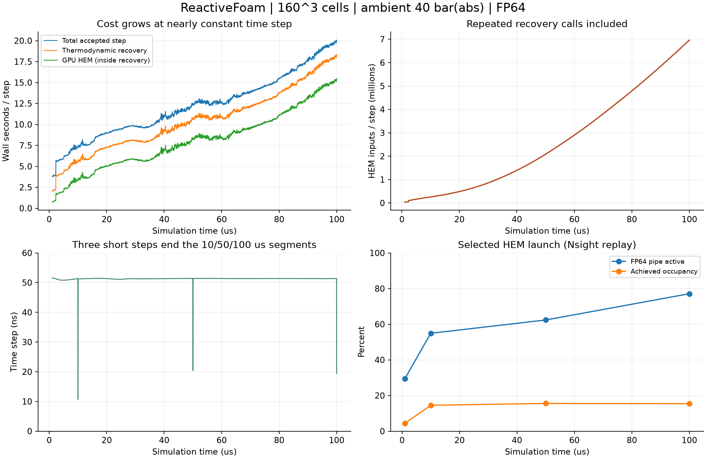

# 160³ · 40 bar · 100 μs 완료 및 GPU 로그 분석

**100 μs까지 정상 완료했다. 본 해석의 85.34%는 열역학 복원이며, 그 내부 GPU HEM 커널만 전체 시간의 65.47%를 차지한다.** 시간이 갈수록 정확 재사용이 가능한 입력의 비율이 줄면서 실제 HEM 계산량이 증가했다. 일반 스텝은 50.81–51.59 ns를 유지했고 재시도는 없으므로, 시간 간격 붕괴가 실행 시간 증가의 원인은 아니다.

후반에는 GPU 사용률과 FP64 부하가 모두 증가했다. 선택된 HEM 호출의 FP64 파이프라인 사용률은 1 μs의 29.45%에서 100 μs의 77.10%가 됐다. 다음 최적화는 HEM 평가 횟수와 FP64 작업량을 줄이는 방향이 우선이다. 단순 전송 최적화나 GPU 사용률 수치만 높이는 접근으로는 현재의 주된 비용을 해결하기 어렵다.

분석일은 2026-09-25이다. 솔버를 다시 실행하지 않고 기존 로그, 성능 카운터, 바이너리 해시와 최종 체크포인트를 검사했다.

## 실행 범위와 완료 검증

- 메시: 160³ = 4,096,000셀, 80 mm 정육면체, Δx = 0.5 mm.
- 환경압 40 bar(abs), 공급압 55 bar(g), 공급 온도 293.15 K.
- 90° 방향의 지름 5 mm 원형 입구 두 개, z = 40 mm. 고정 저장조 상태를 사용하는 경계이며 실제 노즐 내부는 해석하지 않는다.
- 검증된 1 μs FP64 체크포인트에서 10 → 50 → 100 μs로 이어서 계산했다. 이 보고서의 본 해석 비용은 **1–100 μs** 구간이다.
- 점성, 열전도, WALE, 난류 열·종 혼합, 표면장력, flashing 활성. 고체상·승화·연소·분자 종 확산은 비활성.
- 본 해석 3개 구간, Nsight Systems 4회, Nsight Compute 4회 모두 검증 통과. 카운터 검증도 네 시각 모두 통과.
- 이번 실행에서 1,931스텝 추가, 체크포인트 누적 1,951스텝. 재시도 0건, GPU HEM 실패·CPU 폴백 0건, WALE 물성 실패·호스트 엔탈피 셀 처리 0건.
- 최종 체크포인트의 파일 무결성·배열·상 재고를 독립적으로 다시 검사했으며 기존 검증 결과와 일치했다.
- 최대 정규화 보존 잔차: 질량 2.1344×10⁻¹¹, 에너지 1.7968×10⁻¹¹, 종 1.6604×10⁻¹¹, 원소 1.7100×10⁻¹¹.

수치 실행·보존 검증 통과는 HEM/확산 계면 모델 자체의 실험적 정확도나 액적 분열의 공간 수렴 검증을 의미하지 않는다. 이 케이스는 `Gauss-diffuse`, `noPLIC=1`이다.

## 전체 시간과 분모

2026-09-24 **16:39:58 → 23:29:11 KST**, 전체 캠페인은 **6시간 49분 13초**였다.

| 구분 | 시간 | 범위 |
|---|---:|---|
| 본 해석 프로세스 합계 | **6시간 33분 23초** | 초기화·체크포인트 출력 포함, NVML 모니터링 수행 |
| 독립 진단 프로세스 합계 | 12분 46.58초 | Nsight Systems/Compute 계측 및 replay 영향 포함 |
| 준비·복사·검증·프로파일 export·분석 등 나머지 | 3분 3.28초 | 전체 캠페인 시간에서 위 두 항목을 차감 |

구간별 본 해석은 다음과 같다. 구간 길이가 다르므로 총 시간만으로 성능 변화율을 계산하면 안 된다.

| 해석 구간 | 추가 스텝 | 프로세스 시간 | 스텝당 평균 | 열역학 복원/스텝 시간 |
|---|---:|---:|---:|---:|
| 1–10 μs | 177 | 18분 12.32초 | 6.062초 | 71.46% |
| 10–50 μs | 780 | 2시간 7분 56초 | 9.779초 | 82.44% |
| 50–100 μs | 974 | 4시간 7분 15초 | 15.170초 | 88.58% |

아래 비율의 분모는 **본 해석 프로세스 합계 23,603.32초**다. 서로 중첩되지 않는 항목으로 합계 100%가 된다.

| 작업 | 초 | 전체 본 해석 비율 |
|---|---:|---:|
| 열역학 복원: 상평형·flashing·표면에너지 결합 등 | 20,143.17 | **85.340%** |
| 수송 갱신 | 1,562.74 | 6.621% |
| CFL/시간 간격 계산 | 1,097.82 | 4.651% |
| 되돌리기용 상태 백업 | 582.61 | 2.468% |
| 진단량 계산 | 54.76 | 0.232% |
| 보존량 검사 | 34.92 | 0.148% |
| 연소 등 소스항 | 0.00 | 0.000% |
| 스텝 안의 기타 | 0.10 | 0.0004% |
| 스텝 타이머 밖: 초기화·출력·종료 등 | 127.21 | 0.539% |

GPU HEM 커널 합계는 **15,452.53초(4시간 17분 32.53초)**다. 이는 위 열역학 복원에 **포함**되며 전체 시간의 65.47%, 복원 시간의 76.71%다. HEM 전용 전송 타이머는 126.00초다. 이 전송 타이머를 수송 전체의 전송 비용으로 일반화하면 안 된다.

복원에서 HEM 커널을 차감한 4,690.64초에는 입력 분류·정확 재사용·packing·계면 갱신·전송·동기화 등이 남는다. 전부 CPU 계산이라고 단정할 수 없다. `nestedBatchCallSeconds`, `nestedBatchPackSeconds`, WALE 물성 시간은 상위 타이머와 겹치므로 위 표에 더하지 않았다.

## 시간이 늘어난 이유와 시간 간격



첫 본 해석 스텝은 3.848초, 마지막 스텝은 20.069초로 약 **5.21배** 증가했다. 같은 시점의 GPU HEM 커널 시간은 0.759 → 15.456초다. 본 해석 마지막 스텝의 숫자이며, 상태 파일에 남은 Nsight Compute replay의 225.6초와 구별해야 한다.

| 구간 | 정확 재사용 비율 | 실제 GPU HEM 입력 건수 |
|---|---:|---:|
| 1–10 μs | 98.93% | 28,806,569 |
| 10–50 μs | 94.10% | 753,855,875 |
| 50–100 μs | 73.31% | 4,258,628,664 |

분모는 해당 구간의 전체 복원 대상 건수다. 위 건수는 반복 복원·RK 단계·여러 스텝을 포함하며, 서로 다른 공간 셀 수가 아니다. 스텝당 실제 입력은 처음 **33,191건 → 마지막 6,958,926건**으로 증가했다. 변화가 전파되며 비트 단위로 같은 입력을 재사용하는 비율이 줄어든 것이 비용 증가와 맞물린다.

누적 GPU 계수는 상 물성 평가 약 1.704×10¹²회, 잔차 평가 2.831×10¹²회, 유한차분 Jacobian 1.292×10¹¹회다. 분석 Jacobian 호출은 0회다. 이 계수는 각각 중첩된 평가 횟수이며 서로 더한 값이 독립 작업 수는 아니다.

일반 스텝의 최소/평균/최대는 **50.810 / 51.322 / 51.593 ns**다. 세 구간 종료 시에만 각각 10.699, 20.368, 19.335 ns로 잘려 목표 시각에 맞췄다. 30–50 ns라는 이전 희망 범위보다 일반 스텝이 약간 크지만, 현재 실행에서 메시 때문에 극소 시간 간격으로 내려가는 현상은 없다. 이번 분석에서는 설정을 바꾸지 않았다.

## GPU 부하·메모리·전력

본 해석의 0.5초 간격 NVML 샘플을 실제 표본 시각으로 적분한 평균이다. GPU 사용률은 샘플 기간 중 장치 작업 비율이며 **SM 점유율이나 계산 처리량 비율이 아니다**.

| 구간 | 평균 전력 | 평균 GPU 사용률 | 평균 SM 클록 | 최대 VRAM | 최대 온도 |
|---|---:|---:|---:|---:|---:|
| 1–10 μs | 87.63 W | 47.08% | 2813.7 MHz | 8.40 GiB | 60°C |
| 10–50 μs | 113.12 W | 65.53% | 2811.9 MHz | 8.51 GiB | 60°C |
| 50–100 μs | **132.98 W** | **75.01%** | 2811.7 MHz | **8.53 GiB** | 60°C |

최대 표본 전력은 181.60 W, 본 해석 동안 장치 소비 에너지 추정은 0.816 kWh다. 장치 전체 값으로 디스플레이 등의 사용도 포함한다. 모든 본 해석 샘플의 클록 이벤트 마스크는 0, 솔버 스왑 사용량은 0이었다. 관측 범위에서 전력 제한·열 제한·VRAM 용량 부족이 원인이라는 증거는 없다.

CPU 사용 시간은 각 구간의 실제 시간과 비슷해 약 한 코어를 계속 사용했다. CUDA API의 호스트 대기/폴링도 CPU 시간에 포함될 수 있으므로 이를 CPU 물리 계산 비중으로 해석하지 않는다.

수송 누적 payload는 약 12.37 TB, 레이아웃 event wait은 약 217.8만 회다. 호스트·장치 왕복과 작은 staging 작업이 남아 있으나, 이 바이트 수와 대기 횟수만으로 전체 시간을 모두 전송 병목에 할당할 수는 없다.

## 상세 카운터: FP64 비중의 변화

각 진단은 원래 체크포인트에서 별도로 실행한 1스텝이다. NCU는 첫 번째/세 번째 호출 중 수집 가능한 호출을 계측했으며 아래 HEM 표는 그중 더 오래 걸린 호출이다. 전체 솔버의 가중 평균이나 모든 SM/스레드를 동일하게 조사한 값이 아니다.

| 체크포인트 | HEM/전체 GPU 커널 시간¹ | HEM/해당 스텝 시간¹ | HEM FP64 파이프² | HEM 달성 점유율² | HEM DRAM 대역폭² |
|---|---:|---:|---:|---:|---:|
| 1 μs | 57.60% | 19.29% | 29.45% | 4.44% | 3.17 GB/s |
| 10 μs | 85.23% | 45.69% | 54.91% | 14.52% | 75.69 GB/s |
| 50 μs | 93.54% | 66.85% | 62.37% | 15.56% | 122.60 GB/s |
| 100 μs | **96.32%** | **76.56%** | **77.10%** | **15.41%** | **154.04 GB/s** |

¹ Nsight Systems 커널 시간. ² Nsight Compute replay 표본. 두 계측의 절대 시간을 섞어 합산하지 않는다. FP64 파이프 77.1%는 전체 해석 시간의 77.1%가 FP64라는 뜻이 아니다.

100 μs의 주요 커널을 비교하면 다음과 같다.

| 커널 | 레지스터/스레드 | 달성 점유율 | FP64 파이프 | DRAM GB/s | L1/L2 적중률 |
|---|---:|---:|---:|---:|---:|
| HEM | **255** | 15.41% | 77.10% | 154.04 | 43.24 / 97.92% |
| WALE PR 물성 | 228 | 16.58% | 81.39% | 348.32 | 42.88 / 50.79% |
| 면 유량 `Faces` | 122 | 30.59% | 86.45% | 136.89 | 81.62 / 78.40% |
| 보존량 갱신 `Advance` | 92 | 30.09% | 36.40% | 689.93 | 20.90 / 53.39% |
| 계면 구배 | 38 | 94.08% | 61.69% | 757.65 | 38.15 / 69.24% |
| 계면 곡률 | 44 | 79.43% | 82.82% | 741.53 | 55.59 / 68.17% |

HEM의 이론 점유율 상한도 16.67%라서 15.41%는 그 상한에 가깝다. 낮은 warp 점유율과 별개로 SM 활성/경과 사이클에서 유도한 활성 비율은 약 90.79%다. 즉, 후반에는 작업이 부족해 대부분의 SM이 쉬는 상황과 다르며, 높은 레지스터 사용량 때문에 동시에 유지할 warp 수가 적다.

선택된 HEM의 실행 FP64 FLOP은 약 5.436×10¹¹, FP32 FLOP은 2.946×10¹⁰이다. FP64 실효 처리량은 413.85 GFLOP/s였다. ALU 파이프는 0.89%, tensor 파이프는 0%다. 이는 해당 호출의 동적 카운터이며 전체 프로그램의 정밀도별 실행 시간 분해는 아니다.

HEM의 분기 균일도는 99.23%, eligible warp는 scheduler당 0.08, issue active는 8.18%다. 지역 메모리 sector 트래픽도 크지만 L2 적중률은 97.92%다. 이 측정에서는 DRAM 최대 대역폭보다 FP64 처리·의존성·레지스터 압력이 우선 병목이라는 해석이 타당하다. 레지스터를 강제로 낮추면 spill이 증가할 수 있어 실측 없이 해결책으로 확정할 수 없다.

`Advance`는 long-scoreboard 지표가 발행 명령당 62.53사이클이고 약 690 GB/s를 사용해 메모리 지연/대역폭 최적화가 더 맞는 대상이다. 다만 100 μs 진단의 HEM 시간은 15.226초인 반면, WALE 관련 커널 합계는 0.135초, 계면 관련 커널 합계는 0.048초였다. 후자의 커널만 고쳐서는 전체 속도 개선 폭이 작다. 표면장력을 끄는 효과는 결합 복원 횟수까지 달라질 수 있으므로 계면 커널 0.048초만으로 추정할 수 없다.

## 최종 물리량

| 항목 | 100 μs 값 |
|---|---:|
| 압력 범위 | 39.8124–40.8864 bar(abs) |
| 온도 범위 | 220.702–293.344 K |
| 영역 내 N₂O 총질량 | 15.63946 mg |
| 액체 N₂O 질량 | 10.65560 mg |
| 기체 N₂O 질량 | 4.98385 mg |
| N₂O 기체 질량분율 | 31.8672% |
| 액체 체적분율 최대값 | 0.32648 |
| 고체 N₂O 질량 | 0 |

이는 영역 내 N₂O 재고의 상 분배다. 주변 공기도 기체이므로 `alphaGas`를 N₂O 기화율로 사용하지 않았다. 이번 로그 분석만으로 충돌 후 액주·액막 분열이나 액적 크기 분포를 판정하지 않는다.

## 다음 최적화의 우선순위

1. **후반 상태의 HEM 평가 횟수 절감.** 50·100 μs 체크포인트를 기준으로 후보 탐색·잔차·유한차분 Jacobian 중복을 먼저 줄인다. 수렴·상 선택·보존 검증을 유지해야 한다. 현재 분석 Jacobian은 0회이며 소스의 분석 경로는 압력 점프 등 적용 조건이 있어 단순 옵션 전환으로 전 구간을 대체할 수 없다.
2. **현재 HEM의 실제 후반 입력에 대한 혼합 정밀도.** FP32/정수 변환을 다시 평가할 이유가 초기보다 강해졌다. 후보 생성·초기 추정·선형계 등 한정된 부분부터 비교하고 최종 FP64 잔차·상 선택 검증을 남기는 실험이 적절하다. 이번 자료 자체는 FP32 속도 향상을 측정한 결과가 아니다.
3. **HEM 레지스터·지역 메모리 사용량 축소.** 큰 임시 상태와 수명, 단일 스레드 작업 묶음을 검토한다. FP64 파이프가 이미 상당히 사용되므로 점유율 숫자 상승만으로 성공을 판정하지 않는다.
4. **복원 주변의 호스트 순회·왕복과 전역 반복 절감.** 셀 입력 분류, packing, 계면 갱신 및 상태 복사 경로를 분리 계측한 뒤 이동·상주화를 검토한다. 정확 재사용을 임의 허용 오차의 재사용으로 바꾸는 것은 별도 정확도 실험이다.
5. WALE·계면 stencil·일반 수송은 그 다음이다. 관련 기능을 빼기 전에 HEM 개선의 효과를 먼저 측정하는 편이 이 자료에 부합한다.

단순한 상한 계산으로 GPU HEM 시간을 절반으로 줄이고 나머지가 같다면, 이번 전체 본 해석은 약 **1.49배** 빨라진다. 이는 예측 성능이나 구현 결과가 아니라 현재 65.47% 비용 비중을 대입한 Amdahl 계산이다.

## 계측 한계와 재현 자료

- Nsight 실행은 초기화와 큰 체크포인트 출력도 포함한다. 전체 trace의 GPU duty를 정상 스텝 duty와 혼동하지 않는다.
- CUDA 커널·전송은 수집됐고 HEM trace 호출 수는 솔버 카운터와 일치했다. `/usr/bin/time` 래퍼에는 CUDA 이벤트가 없다는 진단이 있으며, 솔버 프로세스에는 CUDA 이벤트가 있다.
- NVTX 이벤트가 없고 CPU 스케줄링 정보는 수집하지 않았다. 따라서 CPU 함수별 비용, 모든 CPU 대기 원인의 확정적 분해는 불가능하다.
- NCU replay의 지역 메모리 백업·클록 변동이 절대 시간에 영향을 줄 수 있다. 일부 다른 커널의 SM 활성/경과 비율이 100%를 조금 넘는 replay 산술값은 병목 결론에 사용하지 않았다.
- 과거 1 μs 비계측 벤치마크와 이번 캠페인의 총 시간을 직접 비교하지 않는다.

원시 자료: `/home/jsw/문서/analysis/runs/n160_40bar_100us_gpu_20260924`.
솔버 소스 기준: `d1c4e973bf0216152f93f3c77fa9da0a08500bef`의 별도 바이너리·도구 복사본.

- [감사 결과·구간별 GPU 통계·최종 물리량 JSON](../results/benchmarks/n160-40bar-100us-gpu-20260924/analysis.json)
- [전체 스텝 CSV](../results/benchmarks/n160-40bar-100us-gpu-20260924/steps.csv)
- [시간 비중 CSV](../results/benchmarks/n160-40bar-100us-gpu-20260924/time-breakdown.csv)
- [시각별 전체 커널 시간 CSV](../results/benchmarks/n160-40bar-100us-gpu-20260924/profiled-kernels.csv)
- [선택 호출 상세 카운터 CSV](../results/benchmarks/n160-40bar-100us-gpu-20260924/selected-kernel-counters.csv)
- [재현 분석 도구](../tools/analyze_long_gpu_campaign.py)

```bash
python tools/analyze_long_gpu_campaign.py \
  /home/jsw/문서/analysis/runs/n160_40bar_100us_gpu_20260924 \
  --output results/benchmarks/n160-40bar-100us-gpu-20260924
```
