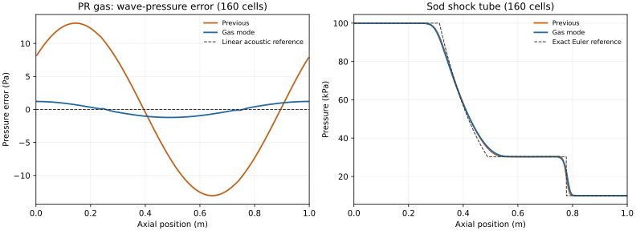

# 초음속 대응 시험·개선 — 2026-09-11

PR 기체의 파동 전파속도 오차를 줄이는 순수 기체 경로를 구현하고, 표준 문제와 실제 309만 셀 격자에서 검증했다. 최종 바이너리의 기체 조건 12개 중 10개가 기준을 통과했고, 80셀 초음속 음향파 2개는 감쇠 기준을 통과하지 못했다. 기존 3상 경로는 사전 정의한 수치·순차 source 기준을 통과했지만 비트 단위 동일성은 보장되지 않는다.

## 개선 범위와 방정식

기존 3상 VOF 경로를 기본값으로 유지하고 `pintleGasDynamics true`인 순수 기체 검증 경로를 추가했다. 선택한 상은 셀과 경계에서 1, 나머지 상은 0이어야 한다. 고정 격자, 중력 0, 층류, 전역 Euler 시간 적분, `hConst/const`와 이상기체 또는 PR 기체를 대상으로 한다. 비압축성 IPA를 유한 음속 액체로 바꾸거나 3상 충격파–계면 물리를 구현한 것은 아니다.

PR 물성에서 기존 `psi=rho/p`를 보존하고, 새 압력 선형화에는 별도의 `(∂rho/∂p)_T`를 사용한다. 내부에너지는 `e=(Cp0−R)T+eDeparture`로 두며, PR departure에는 정확한 √2 계수를 사용한다. 압력과 에너지의 결합에 쓰는 `de/dT|p`, `Cv`, `Cp`, 음속도 같은 EOS에서 계산한다. 음속은 다음 열역학 항등식으로 결정한다.

\[
a^2=\left(\frac{\partial p}{\partial\rho}\right)_T+
\frac{T}{\rho^2 C_v}\left(\frac{\partial p}{\partial T}\right)_\rho^2.
\]

온도 방정식은 기존 행렬을 전처리기로 사용하되, 수렴할 때 EOS 내부에너지와 운동에너지의 보존식, 압력 일, 열전도 및 점성 일이 만족되도록 잔차를 보정한다. 압력·운동량·에너지·최종 보존 진단은 갱신한 동일한 면 질량 유량을 사용한다. 새 경로에서 `phi`는 체적 유량이고 `rhoPhi`는 질량 유량이다.

물리 시간 단계마다 최대 국소 질량·에너지 잔차를 출력하고, 기본 기준 `1e-4`를 넘으면 중단한다. 잔차는 각각 `dt/rho`, `dt/[rho(Cp0−R)T+rho K]`로 정규화한다. 압력이 `pMin`에 걸리면 clipping으로 계속 진행하지 않고 중단한다. EOS 음속을 포함한 모든 유효 면의 파동 Courant 수도 기록하며, `adjustTimeStep yes`이면 `maxWaveCo`로 시간간격을 제한한다. 고정 시간간격에서는 이 값이 진단값이다.

## 열역학 및 음향파

이상기체와 PR의 32개 `(rho,T)` 상태에서 240개 중심차분·열역학 항등식을 확인했다. 온도는 270/300/340/450 K, 밀도는 1/10/40/80 kg/m³이다. 최대 정규화 차분 오차는 `1.200e-7`, CPU/GPU의 8개 물성 출력 차이는 0이었다. 이는 선택한 기체 상태에서의 미분·구현 일관성 검증이며 기액 상평형 검증은 아니다.

아래 파동 시험은 압력 2 MPa, 온도 300 K, 상대 압력 진폭 `1e-4`의 주기 경계 문제다. 각 조합에서 이전/새 경로에 동일한 격자·시간간격·외부 반복 4회를 사용했다. 80셀은 100스텝, 160셀은 200스텝이며 한 파장의 1/4만큼 진행한다. 따라서 두 격자의 비교는 공간과 시간 해상도를 함께 높인 결과다.

| 기체·평균 Mach | 셀 수 | 전파속도 오차 %, 이전 → 새 경로 | 진폭비, 이전 → 새 경로 | 전체 기준, 이전 → 새 경로 |
|---|---:|---:|---:|---|
| PR N₂O, 0 | 80 | 3.45769 → 0.028883 | 0.955295 → 0.987464 | 실패 → 통과 |
| PR N₂O, 0 | 160 | 3.41997 → 0.011155 | 0.961316 → 0.993950 | 실패 → 통과 |
| 공기, 1.1 | 80 | 0.519099 → 0.106444 | 0.962552 → 0.946056 | 통과 → 실패 |
| 공기, 1.1 | 160 | 0.218411 → 0.090009 | 0.981032 → 0.972662 | 통과 → 통과 |
| PR N₂O, 1.1 | 80 | 3.16968 → 0.091477 | 0.951933 → 0.948919 | 실패 → 실패 |
| PR N₂O, 1.1 | 160 | 2.85916 → 0.106182 | 0.968593 → 0.974269 | 실패 → 통과 |

기준은 속도 오차 ≤1%, 진폭비 0.95–1.02, 압력 섭동으로 정규화한 L1 ≤5%, 반대 방향 특성 성분 ≤3%, 주기 질량·총에너지 변화 ≤1e-7이다. 새 경로의 6개 결과에서 질량 변화는 최대 `1.2e-14`, 에너지 변화는 최대 `3.89e-13`이었다. PR 정지 기체의 80셀 속도 오차는 약 120배 작아졌다. 이는 오차 개선 비율이며 실행 속도 향상 비율이 아니다.

새 경로는 공기 M=1.1에서 위상 오차를 줄였지만 감쇠와 압력 L1 오차는 늘렸다. 80셀의 공기와 PR 초음속 파동은 진폭 하한을 통과하지 못한다. 160셀에서 기준을 통과하지만, 두 격자만으로 정식 수렴 차수를 주장하지 않는다. PR M=1.1의 속도 오차도 80→160셀에서 단조 감소하지 않는다.

## 충격관·정상충격파·노즐

이상기체 충격파의 이전/새 경로 10개 시험은 모두 기준을 통과했다. Sod 문제는 80/160셀, 외부 반복 8회로 계산했다. 각 셀에서 보존량의 정확해를 128개 중점으로 평균한 뒤 원시변수로 변환한 기준과 비교했다.

| Sod 정규화 L1 오차 % | 80셀 이전 | 80셀 새 경로 | 160셀 이전 | 160셀 새 경로 |
|---|---:|---:|---:|---:|
| 압력 | 1.3653 | 1.6135 | 0.7753 | 0.9440 |
| 밀도 | 1.7653 | 1.9513 | 1.0817 | 1.2508 |
| 속도 | 2.2443 | 2.6849 | 1.1828 | 1.4748 |
| 온도 | 4.6865 | 5.8751 | 2.9767 | 3.7516 |

오차 기준은 압력 3%, 밀도 4%, 속도 5%, 온도 8%다. 새 경로가 이 기준을 만족하지만 이전 경로보다 오차가 크다. 외부 반복 4회의 초기 Sod 시험은 에너지 잔차 `2.07e-3`으로 거부되었고, 8회로 늘린 조건을 위의 동등 비교에 사용했다. 실패 실행도 보존했다.

유입 Mach 1.1의 정상충격파에서 새 경로의 압력 점프 상대 오차는 80셀 0.06114%, 160셀 0.03569%였다. 밀도 점프 오차는 0.03875%/0.02497%, 질량 유속 점프는 0.08653%/0.05289%, 정체 엔탈피 점프는 0.03283%/0.01715%였다. 충격파의 격자상 위치 오차는 두 경우 모두 0셀이다. 이전 경로도 통과했고 점프 오차는 더 작았다. 각 점프 기준은 3%, 위치 기준은 2셀이다.

이동하는 약한 충격파의 80셀 결과는 두 경로 모두 정확 위치 0.440971 m에 대해 0.4375 m였다(0.278셀 차이). 새 경로의 네 원시변수 정규화 L1은 모두 1.45% 미만으로 기준 8%를 만족했다. 새 경로의 충격파 시험 전체에서 최대 국소 질량/에너지 잔차는 `1.64e-7`/`4.76e-6` 이하였다.

노즐은 목 면적에 대한 입·출구 면적비 2, 총압 200 kPa, 총온도 300 K, 축방향 80셀의 초기화된 준1차원 천음속 profile을 2 ms 동안 640스텝으로 계산했다. 셀 중심의 `rho U A` 평균을 단위 깊이당 유량으로 비교하면 이론 0.466669 kg/(s·m)에 대해 이전 0.480346, 새 경로 0.480097이었다. 오차는 2.931% → 2.877%, 축방향 상대 편차는 3.587% → 3.510%로 두 경로 모두 5% 기준을 만족했다. 최종 최대 Mach는 이전 2.1268, 새 경로 2.0865였다.

노즐 시험은 초기화한 천음속 profile의 유지 시험이다. 배압 sweep으로 초킹의 선택을 입증하거나, 다차원 노즐을 충분히 분해하거나, 노즐 격자 수렴성을 검증한 결과는 아니다.



## 입력 거부와 시간간격 제어

다음 7개 검증이 통과했다: 혼합 상분율 거부, 에너지 항의 backward 지정 거부, 상별 밀도 항의 backward 지정 거부, `Cp≤R` 거부, 재시작 면 유량의 단위 불일치 거부, binary 면 유량의 NaN 거부, 자동 시간간격에서 파동 Courant 수 ≤0.2 유지. 재시작 질량 유량은 모든 면에서 유한함을 검사하고, donor-cell 밀도로 변환한 체적 유량이 원래 질량 유량을 상대 오차 `1e-12` 이내에서 복원하는지 확인한다.

## 실제 공기 case의 적용 조건

사용자가 지정한 `rhoPimpleFoam` 결과는 3,094,455셀의 공기 단상 case다. 490 µs의 `p/T/rho/U`와 면 질량 유량을 복제하여 별도 디렉터리에서 이어 계산한다. 기존 `phi`는 질량 유량이므로 객체 이름을 `pintleInitialMassFlux`로 바꿔 읽고, 새 솔버가 체적 유량으로 변환한다. 원본 격자·설정·시작장은 해시로 보호한다. 경계의 정압과 온도 조건, `R=RR/28.96`, `Cp=1005`, `mu=1.8e-5`, `Pr=0.7`을 유지한다.

초기 시험은 선형 허용오차 `1e-10`에서 일부 압력 풀이가 0회 반복으로 끝나고 국소 질량 잔차 기준에 실패했다. `1e-13`, `minIter 1`, 외부 반복 4회로 바꾸자 25 ns의 4스텝 시험이 통과했다. 최대 국소 질량 잔차는 `7.84e-7`, 에너지 잔차는 `1.89e-5`였다. 같은 0.1 µs를 12.5 ns의 8스텝으로 계산하면 잔차는 각각 `1.02e-7`, `2.46e-6`이었다.

이 짧은 구간에서 25/12.5 ns의 상대 L2 차이는 압력 0.01570%, 온도 0.00517%, 밀도 0.01274%, 속도 0.02354%였다. 셀별 최대 절대 차이는 압력 39.4 kPa, 온도 1.33 K, 속도 성분 1.11 m/s로 별도 기록했다. 이 비교를 전체 10 µs 구간의 시간 수렴성 검증으로 확대하지 않는다.

490→500 µs의 400스텝은 587.5초에 완료되었고 실행·잔차·원본 보존 및 별도 비교 기준을 모두 통과했다. 최대 파동 Courant 수는 1.36093으로, 실행 전에 지정한 고정 시간간격 진단 상한 1.5 이내였다. 최대 국소 질량/에너지 잔차는 `7.84e-7`/`1.89e-5`, 시간 단계별 전역 에너지 수지의 최대 절댓값은 `2.15e-13`이었다. 압력 clipping은 없었다. 이 실제 case는 상 물성의 `device false` 설정을 사용했고, 이 단독 실행 시간으로 성능 배수를 산정하지 않는다.

500 µs에서 기존 결과와의 차이는 다음과 같다. 상대 L1/L2는 셀 체적으로 가중했고, 벡터 속도는 셀별 벡터 크기로 정규화했다. 최대 절대 차이는 성분별 최댓값이다.

| 장 | 체적 가중 상대 L1 % | 체적 가중 상대 L2 % | 최대 절대 차이 |
|---|---:|---:|---:|
| 압력 | 0.001436 | 0.022860 | 1.5105 MPa |
| 온도 | 0.000387 | 0.005429 | 31.736 K |
| 밀도 | 0.001087 | 0.020227 | 16.797 kg/m³ |
| 속도 | 0.656197 | 1.723815 | 158.142 m/s |

최대 Mach는 기존 1.100652, 새 경로 1.060547이다. 순질량 유량은 `inlet_fuel` −0.168542 kg/s, `inlet_oxidizer` −0.250672 kg/s, `farfield` +0.384860 kg/s, `outlet` +0.000161691 kg/s이다. 앞의 두 이름은 원래 경계 이름이며 이 시험의 유체는 모두 공기다. 기존 대비 차이는 두 입구가 각각 0.0228%/0.0800%, farfield가 1.208%였다. 작은 outlet 오차는 두 입구 총유량으로 정규화했으며 `3.58e-7`이다. 모든 벽의 질량·체적 유량은 0이었다.

종료 시각 총질량은 기존 0.0862766894 kg, 새 경로 0.0862766930 kg으로 일치했다. 이는 두 해의 **종료 시각 총질량 일치도**이며, 열린 계의 질량이 시간에 따라 일정하다는 주장이 아니다. 비교 기준은 장 L1 ≤3%, 종료 총질량 차이 ≤0.1%, Mach 차이 ≤5% 및 Mach>1, 주요 경계 유량 차이 ≤5%였다.

큰 셀별 최대 차이가 남아 있으므로 이 결과를 국소 해의 일치나 전체 유동의 정확도 확증으로 해석하지 않는다. 제공된 기존 해도 독립적인 물리 정답은 아니다. 새 경로의 표준해 검증과 이 실제 격자의 짧은 연속 계산은 서로 다른 근거다.

## 기존 3상 경로의 회귀 검증

기존 온도 수렴·동적 접촉각·Euler 제한의 13개 검증은 모두 통과했다. 새 옵션을 끈 소형 case 8스텝과 실제 Pintle 12스텝의 이전/새 바이너리 비교에서는 **비트 단위 동일성 기준이 실패했다**. 이 실패를 그대로 보존했다. Pintle의 최대 차이는 압력 0.001117 Pa, 속도 `9.14e-8` m/s, 온도 `2.38e-8` K, 밀도 `4.86e-7` kg/m³, 상분율 `1.40e-8`이었다. raw `dgdt.air`와 `dgdt.ipa`의 정규화 최대 차이는 각각 약 1.0/0.854로 크다.

같은 입력과 바이너리로 다시 실행한 결과, 이전·새 바이너리 모두 소형/실제 case에서 비트 단위로 일치하지 않았다. 따라서 최초 A/B 차이 전부를 이번 코드 변경에 귀속할 수 없다. 여기서 반복 불일치의 내부 원인을 특정하거나 비트 재현성을 수정했다는 주장은 하지 않는다.

추가 판정에는 이 작업 전에 존재하던 [수치 정책 v1](../policies/numerical-acceptance-v1.json)을 그대로 사용했다. `max_scaled=max|Δf|/max(1,max|f_ref|)` 기준은 압력 `1e-5`, 속도·온도·밀도·상분율 `1e-6`이며, 상분율 범위 `1e-8`, 합 `1e-9`, 단계별 질량 수지 `1e-6`도 확인한다. 두 case 모두 상태 이력·최종장·증거 해시를 포함한 이 정책을 통과했다. 기준을 관측된 차이에 맞춰 바꾸지 않았다.

raw `dgdt`의 큰 차이를 상분율이 작다는 이유만으로 무해하다고 판단하지 않았다. 실제로 소비한 `dgdt/divU`, 순서대로 바뀌는 각 상분율, `Sp/Su`, 유량 발산과 실제 갱신 결과를 기록하여 기존 [순차 replay 검증](../tools/analyze_alpha_replay.py)을 실행했다. 두 case 모두 재구성 오차는 최대 `3.34e-16`으로 `1e-12` 기준을 만족했다. 실제 Pintle의 시간간격을 곱한 source 차이는 최대 `1.82e-11`, 실제 상분율 증분 차이는 최대 `2.15e-8`로 각각 기존 `1e-6` 기준 이내였다. 이는 마지막 기록된 alpha 갱신에 대한 검증이며 모든 시간의 source 이력을 보장하는 판정은 아니다.

## 재현 및 근거

설정과 제약은 [gas-dynamics.md](../docs/gas-dynamics.md), 단계별 계획은 [supersonic-experiment-plan.md](supersonic-experiment-plan.md)를 따른다. 정량 기준은 [run_supersonic_case.py](../tools/run_supersonic_case.py)와 실제 case 비교 도구에 명시되어 있다. 물리 기준은 독립 Riemann 해, 정상충격파 관계식, EOS 미분으로 구한 음속이다. [NASA 정상충격파 관계](https://www.grc.nasa.gov/www/k-12/airplane/normal.html)는 이상기체 점프의 기준을 제공한다.

원시 입력·최종장·실행 로그·자원 표본은 로컬 `benchmarks/`에 보관하고 실행별 SHA-256을 남긴다. 실패 결과도 보존한다. 모든 CFD 및 무거운 분석은 `/home/jsw/cae-benchmark/run.lock`으로 직렬화한다. MAIN이 코드와 실행기를 작성하고 모든 시험을 실행·확인했으며, 보조 검토는 읽기 전용 수식·코드·결과 검토에 사용했다.

기준 바이너리는 수정 전 `benchmarks/supersonic-original/`에 보존했다. 음향파 최종 6개 조건은 마지막 빌드로 다시 실행했고, 충격파·노즐과 함께 최종 소스/바이너리 해시를 확인했다. 대표 비교 12쌍의 격자·초기장·물성·공간 스킴·시간간격·외부 반복 수가 같은지 확인했다. 의도한 경로 선택이 들어 있는 `controlDict`는 파일 전체 동일성에서 제외하고 물리 시간 설정을 별도로 비교했다.

판정·오차·소스와 바이너리 해시의 통합 자료는 [supersonic-validation-results.json](supersonic-validation-results.json)에 있다. 기체 12개 최종 조건 중 2개 감쇠 실패와 기존 경로의 비트 동일성 실패가 이 자료에도 명시되어 있다. 보고서의 판정은 제한된 공학 검증이며 임의의 초음속 유동에 대한 인증을 뜻하지 않는다.

새 출력 디렉터리를 지정하여 다음과 같이 실행한다. `--snapshot`에는 위의 수정 전 바이너리와 라이브러리 보관 위치가 필요하다.

```bash
source env.sh
wmake -j1 src/coldFoam
nvcc -std=c++17 -O3 -arch=sm_120 --ftz=false --prec-div=true --prec-sqrt=true \
  tools/test_gas_eos.cu -o bin/testGasEOS
bin/testGasEOS

python3 tools/run_supersonic_campaign.py --group waves \
  --output benchmarks/reproduce-waves --snapshot benchmarks/supersonic-original
python3 tools/run_supersonic_campaign.py --group shocks \
  --output benchmarks/reproduce-shocks --snapshot benchmarks/supersonic-original
python3 tools/run_supersonic_campaign.py --group nozzle \
  --output benchmarks/reproduce-nozzle --snapshot benchmarks/supersonic-original
python3 tools/check_gas_guards.py --output benchmarks/reproduce-gas-guards

python3 tools/run_air_continuation.py \
  --source /path/to/supplied/rhoPimpleFoam/case \
  --output benchmarks/reproduce-air --start 0.00049 \
  --duration 0.00001 --steps 400 --outer 4 --wave-bound 1.5
python3 tools/compare_air_continuation.py --case benchmarks/reproduce-air \
  --reference /path/to/supplied/rhoPimpleFoam/case \
  --output benchmarks/reproduce-air-comparison.json

python3 tools/check_gas_legacy.py --output benchmarks/reproduce-legacy-exact \
  --snapshot benchmarks/supersonic-original
python3 tools/check_review_regressions.py --source benchmarks/review-mini-input-final \
  --legacy-lib benchmarks/review-original/lib --output benchmarks/reproduce-regressions
```

`check_gas_legacy.py`는 비트 동일성을 요구하므로 위에 보고한 불일치에서 실패 종료한다. 후속 `check_gas_legacy_sources.py`는 보존된 최초 `benchmarks/gas-legacy-ab/`와 비교하여 반복 실행을 확인하고, 기존 수치 정책과 실제 순차 source를 검증하는 이 보고서 전용 실행기다. 통합 수집·그림 도구도 이 보고서에 명시한 원시 디렉터리를 읽는다. 각 캠페인 실행기는 실패 조건을 보존하며 계속 실행하므로, 프로세스 종료 코드와 함께 `campaign.json`의 개별 `acceptance`를 확인해야 한다.
